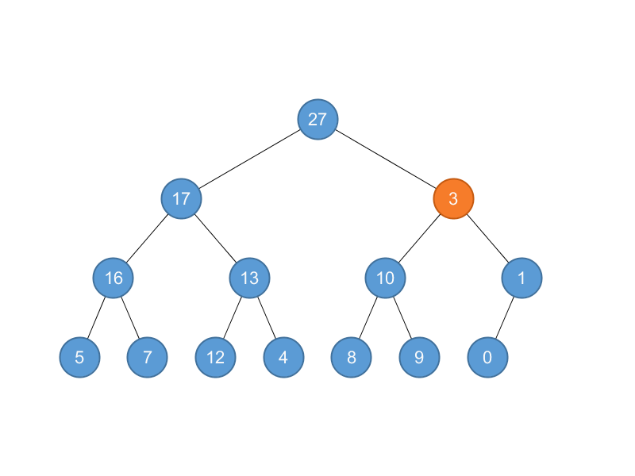
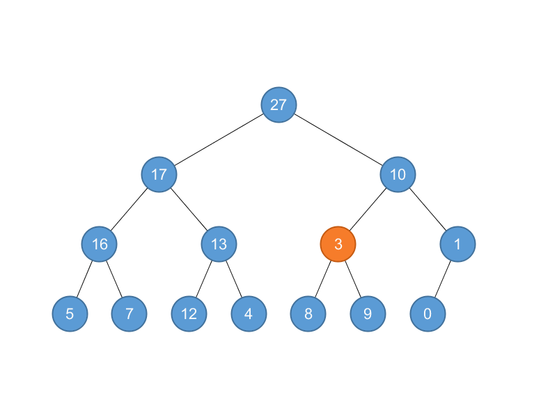
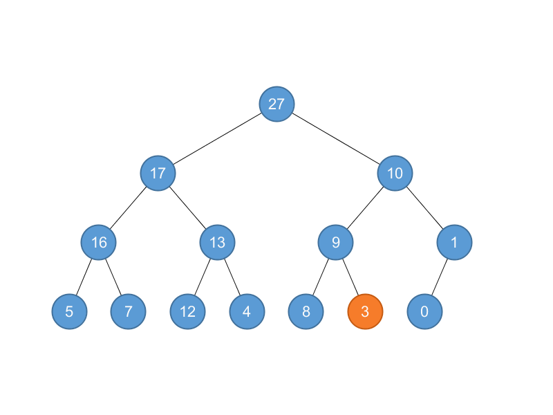

## 6.2 Maintaining the heap property

### 6.2-1

> Using Figure 6.2 as a model, illustrate the operation of MAX-HEAPIFY$$(A, 3)$$ on the array $$A = \left \langle 27, 17, 3, 16, 13, 10, 1, 5, 7, 12, 4, 8, 9, 0 \right \rangle$$.

MAX-HEAPIFY$$(A, 3)$$: $$A[3] = 3, A[6] = 10, A[7] = 1$$, swap $$A[3]$$ and $$A[6]$$.



$$A = \left \langle 27, 17, 10, 16, 13, 3, 1, 5, 7, 12, 4, 8, 9, 0 \right \rangle$$



MAX-HEAPIFY$$(A, 6)$$: $$A[6] = 3, A[12] = 8, A[13] = 9$$, swap $$A[6]$$ and $$A[13]$$.



$$A = \left \langle 27, 17, 10, 16, 13, 9, 1, 5, 7, 12, 4, 8, 3, 0 \right \rangle$$

MAX-HEAPIFY$$(A, 13)$$: $$A[13] = 3$$, done.


### 6.2-2

> Starting with the procedure MAX-HEAPIFY, write pseudocode for the procedure MIN-HEAPIFY$$(A, i)$$, which performs the corresponding manipulation on a minheap. How does the running time of MIN-HEAPIFY compare to that of MAX-HEAPIFY?

```python
def parent(i):
    return (i - 1) >> 1


def left(i):
    return (i << 1) + 1


def right(i):
    return (i << 1) + 2


def min_heapify(a, i):
    min_idx = i
    l, r = left(i), right(i)
    if l < len(a) and a[l] < a[min_idx]:
        min_idx = l
    if r < len(a) and a[r] < a[min_idx]:
        min_idx = r
    if min_idx != i:
        a[i], a[min_idx] = a[min_idx], a[i]
        min_heapify(a, min_idx)
```

Running time is the same.

### 6.2-3

> What is the effect of calling MAX-HEAPIFY$$(A, 3)$$ when the element $$A[i]$$ is larger than its children?

No effect.

### 6.2-4

> What is the effect of calling MAX-HEAPIFY$$(A, 3)$$ for $$i > A.heap\text{-}size=2$$?

No effect.

### 6.2-5

> The code for MAX-HEAPIFY is quite efficient in terms of constant factors, except possibly for the recursive call in line 10, which might cause some compilers to produce inefficient code. Write an efficient MAX-HEAPIFY that uses an iterative control construct (a loop) instead of recursion.

```python
def max_heapify(a, i):
    while True:
        max_idx = i
        l, r = left(i), right(i)
        if l < len(a) and a[l] > a[max_idx]:
            max_idx = l
        if r < len(a) and a[r] > a[max_idx]:
            max_idx = r
        if max_idx == i:
            break
        a[i], a[max_idx] = a[max_idx], a[i]
        i = max_idx
```

### 6.2-6

> Show that the worst-case running time of MAX-HEAPIFY on a heap of size $$n$$ is $$\Omega(\lg n)$$. (Hint: For a heap with $$n$$ nodes, give node values that cause MAX-HEAPIFY to be called recursively at every node on a simple path from the root down to a leaf.)

The height is $$\left \lfloor \lg n \right \rfloor$$.
