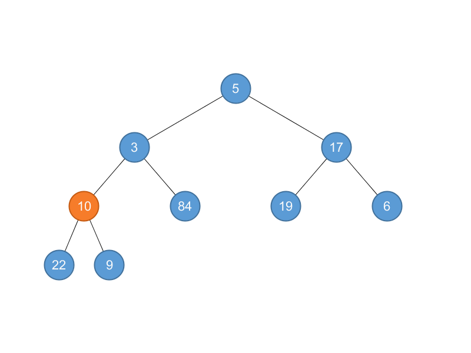
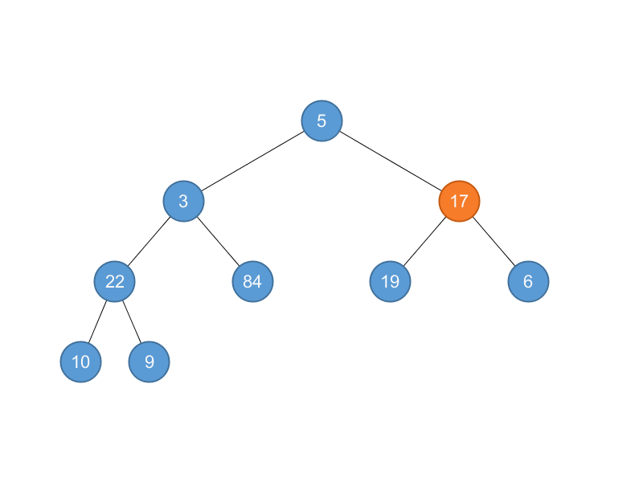
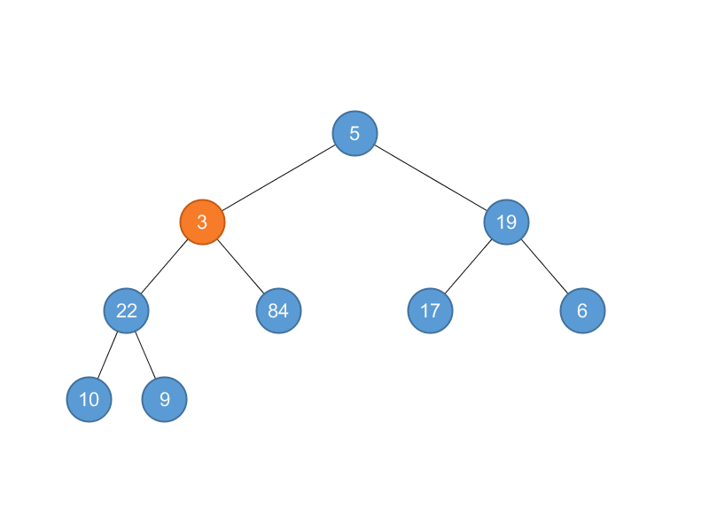
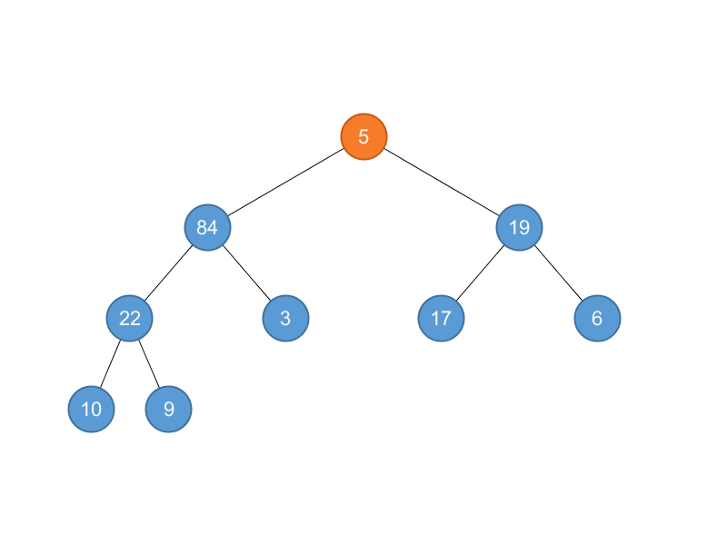
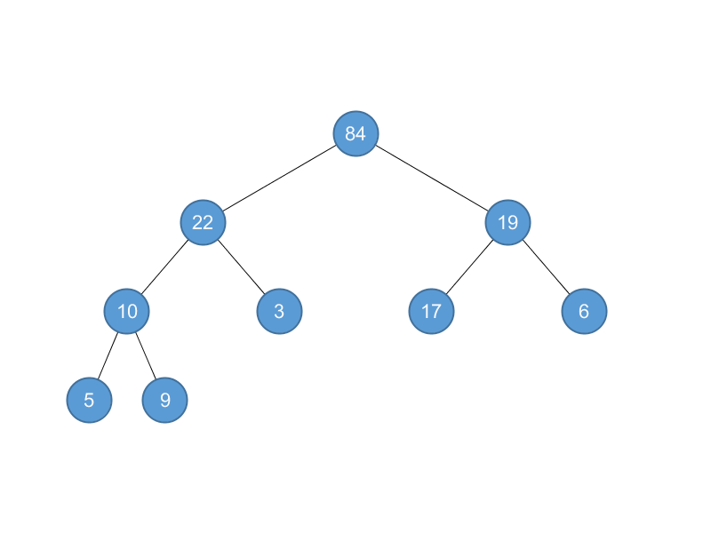

## 6.3 Building a heap

### 6.3-1

> Using Figure 6.3 as a model, illustrate the operation of BUILD-MAX-HEAP on the array $$A = \left \langle 5, 3, 17, 10, 84, 19, 6, 22, 9 \right \rangle$$.

MAX-HEAPIFY$$(A, 4)$$: $$A = \left \langle 5, 3, 17, 22, 84, 19, 6, 10, 9 \right \rangle$$

MAX-HEAPIFY$$(A, 3)$$: $$A = \left \langle 5, 3, 19, 22, 84, 17, 6, 10, 9 \right \rangle$$

MAX-HEAPIFY$$(A, 2)$$: $$A = \left \langle 5, 84, 19, 22, 3, 17, 6, 10, 9 \right \rangle$$

MAX-HEAPIFY$$(A, 1)$$: $$A = \left \langle 84, 22, 19, 10, 3, 17, 6, 5, 9 \right \rangle$$

### 6.3-2

> Why do we want the loop index $$i$$ in line 2 of BUILD-MAX-HEAP to decrease from $$\left \lfloor A.length/2 \right \rfloor$$ to $$1$$ rather than increase from $$1$$ to $$\left \lfloor A.length/2 \right \rfloor$$?

To ensure the subtrees are heaps.

### 6.3-3

> Show that there are at most $$\left \lceil n/2^{h+1} \right \rceil$$ nodes of height $$h$$ in any $$n$$-element heap.

$$
\frac{n - \left \lceil n / 2 \right \rceil}{2^h} = \left \lceil \frac{n}{2^{h+1}} \right \rceil
$$
