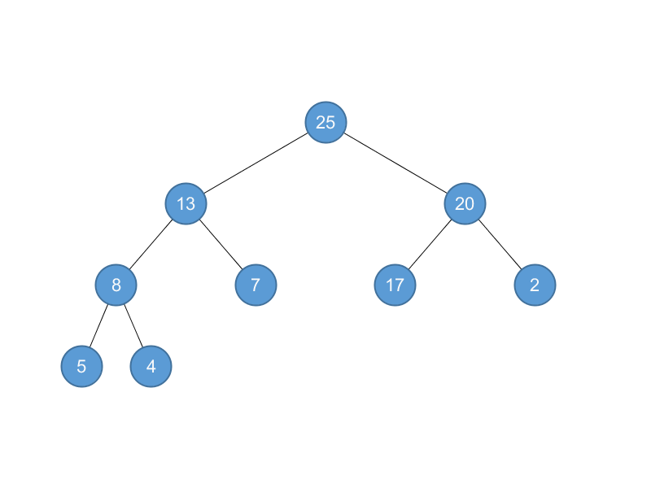
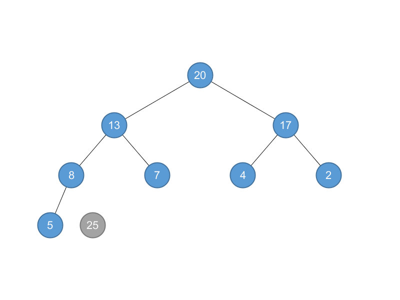
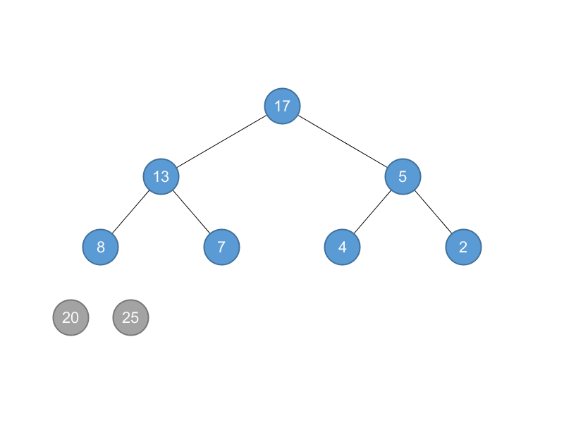
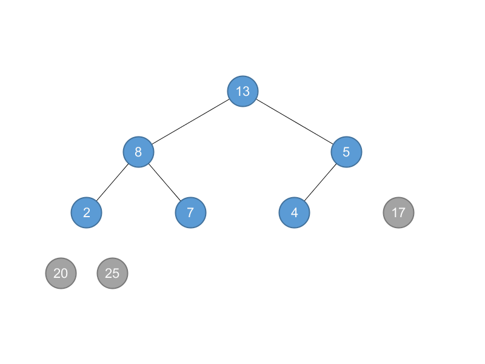
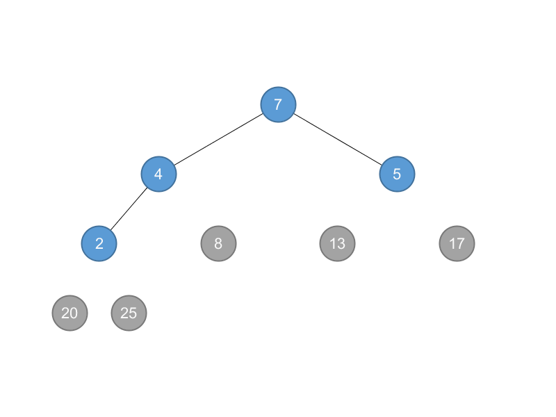
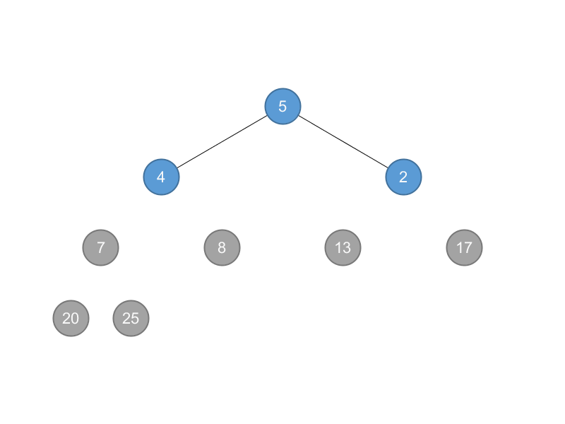
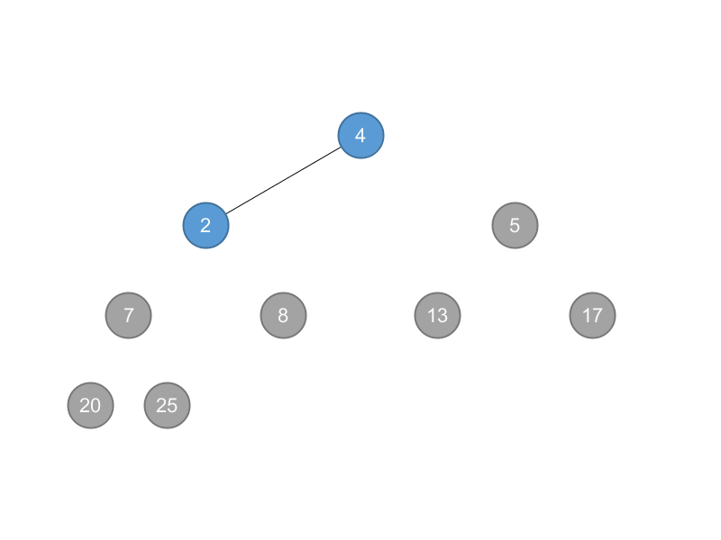
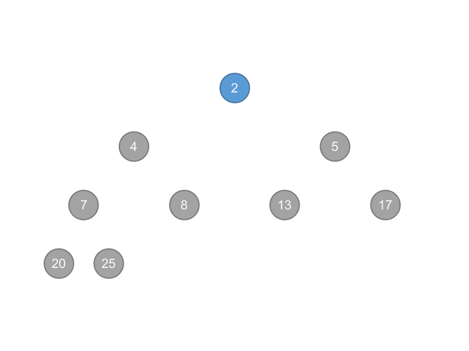

## 6.4 The heapsort algorithm

### 6.4-1

Using Figure 6.4 as a model, illustrate the operation of HEAPSORT on the array $$A = \left \langle 5, 13, 2, 25, 7, 17, 20, 8, 4 \right \rangle$$.

BUILD_MAX_HEAP$$(A)$$: $$A = \left \langle 25, 13, 20, 8, 7, 17, 2, 5, 4 \right \rangle$$

HEAPSORT$$(A)$$:

$$A = \left \langle 20, 13, 17, 8, 7, 4, 2, 5, | 25\right \rangle$$

$$A = \left \langle 17, 13, 5, 8, 7, 4, 2, | 20, 25\right \rangle$$

$$A = \left \langle 13, 8, 5, 2, 7, 4, | 17, 20, 25\right \rangle$$

$$A = \left \langle 8, 7, 5, 2, 4, | 13, 17, 20, 25\right \rangle$$

$$A = \left \langle 7, 4, 5, 2, | 8, 13, 17, 20, 25\right \rangle$$

$$A = \left \langle 5, 4, 2, | 7, 8, 13, 17, 20, 25\right \rangle$$

$$A = \left \langle 4, 2, | 5, 7, 8, 13, 17, 20, 25\right \rangle$$

$$A = \left \langle 2, | 4, 5, 7, 8, 13, 17, 20, 25\right \rangle$$

### 6.4-2

> Argue the correctness of HEAPSORT using the following loop invariant:
>> At the start of each iteration of the for loop of lines 2–5, the subarray $$A[1\dots i]$$ is a max-heap containing the $$i$$ smallest elements of $$A[1\dots n]$$, and the subarray $$A[i + 1\dots n]$$ contains the $$n - i$$ largest elements of $$A[1\dots n]$$, sorted.

In each iteration we move the largest element to the sorted array.

### 6.4-3

What is the running time of HEAPSORT on an array $$A$$ of length $$n$$ that is already sorted in increasing order? What about decreasing order?

Both are $$\Theta(n \lg n)$$ since there are $$n$$ calls to MAX-HEAPIFY.

### 6.4-4

Show that the worst-case running time of HEAPSORT is $$\Omega(n \lg n)$$.

BUILD-HEAD is $$\Theta(n)$$ and MAX-HEAPIFY is $$\Theta(n \lg n)$$.

### 6.4-5 $$\star$$

Show that when all elements are distinct, the best-case running time of HEAPSORT is $$\Omega(n \lg n)$$.

$$\dots$$
