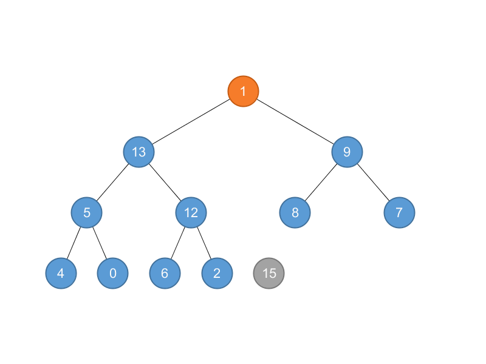
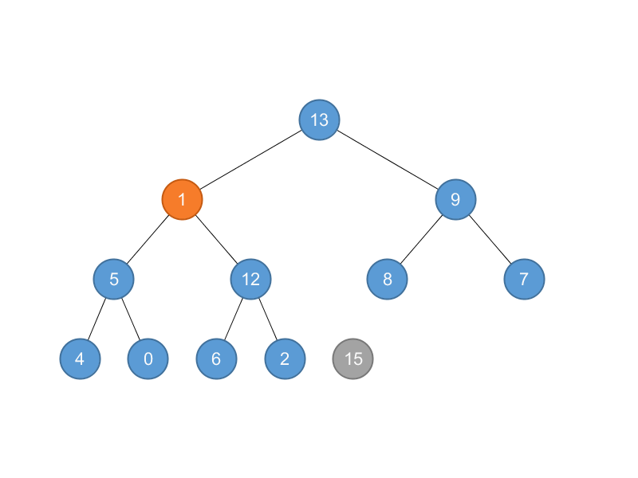
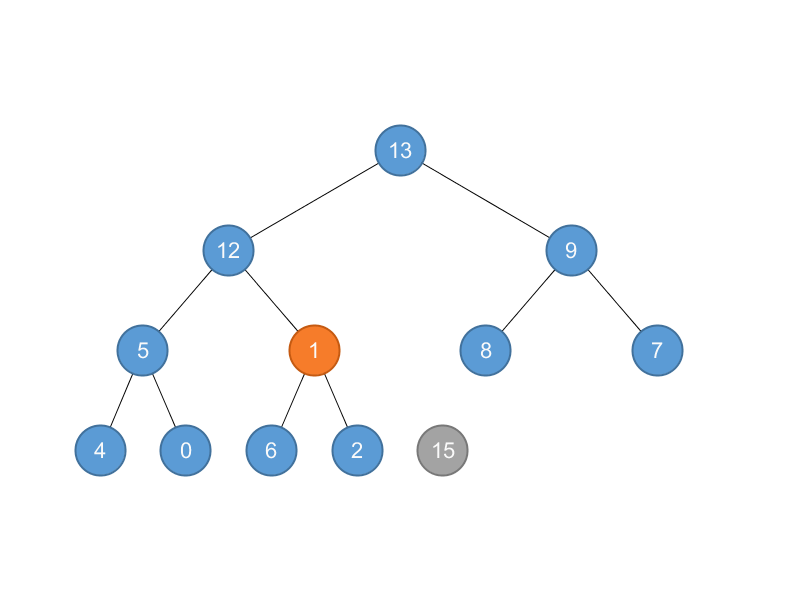
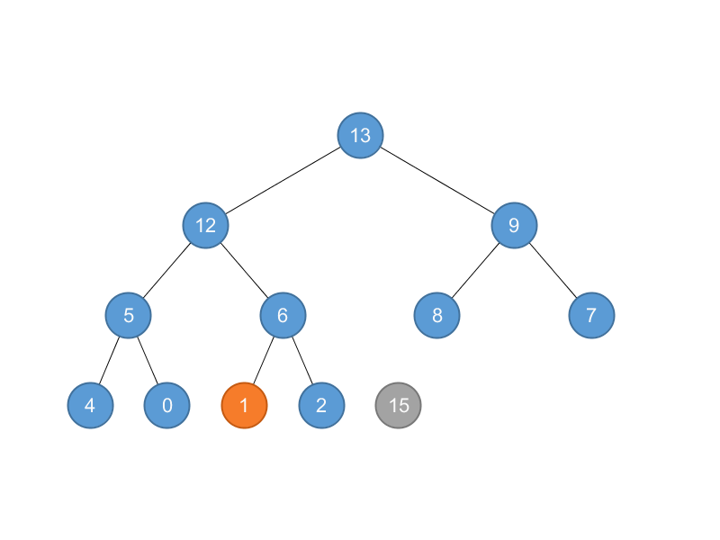
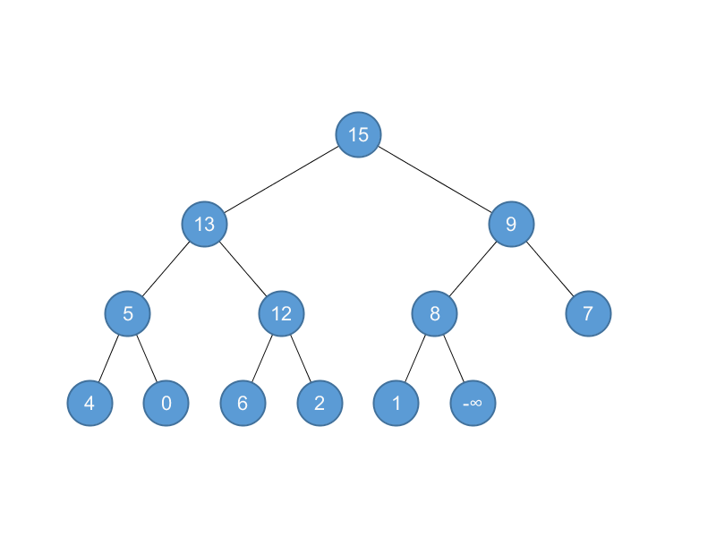
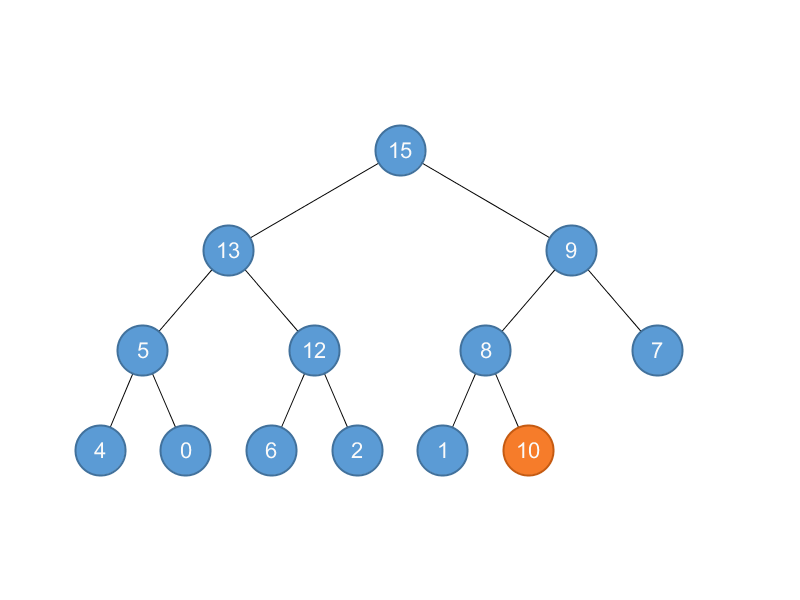
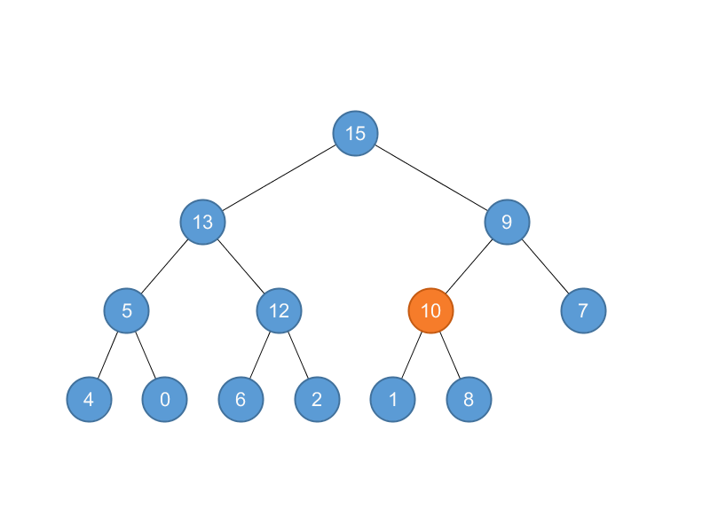
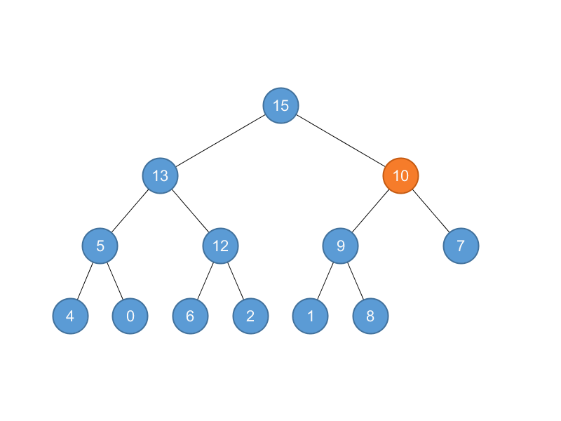

## 6.5 Priority queues

### 6.5-1

> Illustrate the operation of HEAP-EXTRACT-MAX on the heap $$A = \left \langle 15, 13, 9, 5, 12, 8, 7, 4, 0, 6, 2, 1 \right \rangle$$.

Return 15 and $$A = \left \langle 1, 13, 9, 5, 12, 8, 7, 4, 0, 6, 2 \right \rangle$$,



MAX-HEAPIFY$$(A)$$: $$A = \left \langle 13, 12, 9, 5, 6, 8, 7, 4, 0, 1, 2 \right \rangle$$.







### 6.5-2

> Illustrate the operation of MAX-HEAP-INSERT$$(A, 10)$$ on the heap $$A = \left \langle15, 13, 9, 5, 12, 8, 7, 4, 0, 6, 2, 1 \right \rangle$$.

Insert: $$A = \left \langle15, 13, 9, 5, 12, 8, 7, 4, 0, 6, 2, 1, -\infty \right \rangle$$.



Increase: $$A = \left \langle15, 13, 9, 5, 12, 8, 7, 4, 0, 6, 2, 1, 10 \right \rangle$$



Heapify: 

$$A = \left \langle15, 13, 9, 5, 12, 10, 7, 4, 0, 6, 2, 1, 8\right \rangle$$



$$A = \left \langle15, 13, 10, 5, 12, 9, 7, 4, 0, 6, 2, 1, 8\right \rangle$$



### 6.5-3

> Write pseudocode for the procedures HEAP-MINIMUM, HEAP-EXTRACT-MIN, HEAP-DECREASE-KEY, and MIN-HEAP-INSERT that implement a min-priority queue with a min-heap.

```python
def heap_minimum(a):
    assert(len(a) > 0)
    return a[0]


def heap_extract_min(a):
    assert(len(a) > 0)
    val = a[0]
    a[0] = a[-1]
    del a[-1]
    min_heapify(a, 0)
    return val


def heap_decrease_key(a, i, key):
    assert(key <= a[i])
    a[i] = key
    while i > 0 and a[i] < a[parent(i)]:
        a[i], a[parent(i)] = a[parent(i)], a[i]
        i = parent(i)


def min_heap_insert(a, key):
    a.append(1e100)
    heap_decrease_key(a, len(a) - 1, key)
```

### 6.5-4

> Why do we bother setting the key of the inserted node to $$-\infty$$ in line 2 of MAXHEAP-INSERT when the next thing we do is increase its key to the desired value?

To make $$key \ge A[i]$$.

### 6.5-5

> Argue the correctness of HEAP-INCREASE-KEY using the following loop invariant:

>> At the start of each iteration of the while loop of lines 4–6, the subarray $$A[1 \dots A.heap\text{-}size]$$ satisfies the max-heap property, except that there may be one violation: $$A[i]$$ may be larger than $$A[\text{PARENT}(i)]$$.

> You may assume that the subarray $$A[1 \dots A.heap\text{-}size]$$ satisfies the max-heap property at the time HEAP-INCREASE-KEY is called.

Correct.

### 6.5-6

> Each exchange operation on line 5 of HEAP-INCREASE-KEY typically requires three assignments. Show how to use the idea of the inner loop of INSERTION-SORT to reduce the three assignments down to just one assignment.

```python
def heap_increase_key(a, i, key):
    assert(key >= a[i])
    while i > 0 and key > a[parent(i)]:
        a[i] = a[parent(i)]
        i = parent(i)
    a[i] = key
```

### 6.5-7

> Show how to implement a first-in, first-out queue with a priority queue. Show how to implement a stack with a priority queue.

```python
class Queue:
    def __init__(self):
        self.heap = []
        self.inc = 0

    def push(self, val):
        self.inc += 1
        min_heap_insert(self.heap, (self.inc, val))

    def front(self):
        return heap_minimum(self.heap)

    def pop(self):
        return heap_extract_min(self.heap)


class Stack:
    def __init__(self):
        self.heap = []
        self.inc = 0

    def push(self, val):
        self.inc += 1
        max_heap_insert(self.heap, (self.inc, val))

    def top(self):
        return heap_maximum(self.heap)

    def pop(self):
        return heap_extract_max(self.heap)
```

### 6.5-8

> The operation HEAP-DELETE$$(A, i)$$ deletes the item in node $$i$$ from heap $$A$$. Give an implementation of HEAP-DELETE that runs in $$O(\lg n)$$ time for an n-element max-heap.

```python
def heap_delete(a, i):
    if i == len(a) - 1:
        del a[-1]
    else:
        a[i] = a[-1]
        del a[-1]
        max_heapify(a, i)
        heap_increase_key(a, i, a[i])
```

### 6.5-9

> Give an $$O(n \lg k)$$-time algorithm to merge $$k$$ sorted lists into one sorted list, where $$n$$ is the total number of elements in all the input lists. (Hint: Use a minheap for $$k$$-way merging.)

```python
def merge_lists(lists):
    k = len(lists)
    heap = []
    for i in range(k):
        if len(lists[i]) > 0:
            min_heap_insert(heap, (lists[i][0], i))
    idx = [0 for lst in lists]
    a = []
    while len(heap) > 0:
        val, i = heap_extract_min(heap)
        a.append(val)
        idx[i] += 1
        if idx[i] < len(lists[i]):
            min_heap_insert(heap, (lists[i][idx[i]], i))
    return a
```
