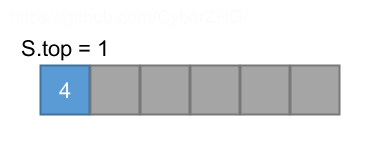
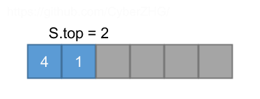
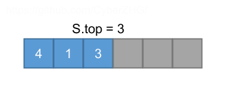
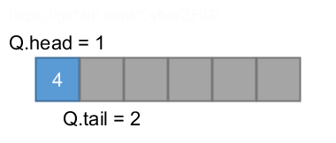
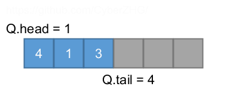
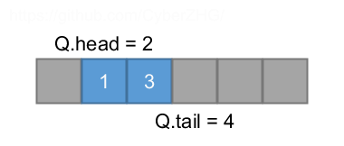
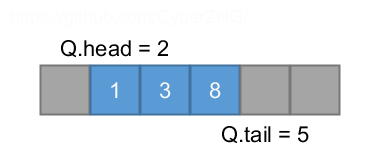
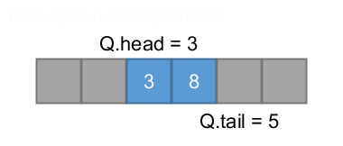

## 10.1 Stacks and queues

### 10.1-1

> Using Figure 10.1 as a model, illustrate the result of each operation in the sequence PUSH$$(S,4)$$, PUSH$$(S,1)$$, PUSH$$(S,3)$$, POP$$(S)$$, PUSH$$(S,8)$$, and POP$$(S)$$ on an initially empty stack $$S$$ stored in array $$S[1 \dots 6]$$.






### 10.1-2

> Explain how to implement two stacks in one array $$A[1 \dots n]$$ in such a way that neither stack overflows unless the total number of elements in both stacks together is $$n$$. The PUSH and POP operations should run in $$O(1)$$ time.

```python
n = 100
a = [-1 for _ in xrange(n)]


class Stack1:
    def __init__(self):
        self.top = -1

    def is_empty(self):
        return self.top == -1

    def push(self, x):
        global a
        self.top += 1
        a[self.top] = x

    def pop(self):
        global a
        self.top -= 1
        return a[self.top + 1]


class Stack2:
    def __init__(self):
        self.top = n

    def is_empty(self):
        return self.top == n

    def push(self, x):
        global a
        self.top -= 1
        a[self.top] = x

    def pop(self):
        global a
        self.top += 1
        return a[self.top - 1]
```

### 10.1-3

> Using Figure 10.2 as a model, illustrate the result of each operation in the sequence ENQUEUE$$(Q,4)$$, ENQUEUE$$(Q,1)$$, ENQUEUE$$(Q,3)$$, DEQUEUE$$(Q)$$, ENQUEUE$$(Q,8)$$, and DEQUEUE$$(Q)$$ on an initially empty queue $$Q$$ stored in array $$Q[1 \dots 6]$$.








### 10.1-4

> Rewrite ENQUEUE and DEQUEUE to detect underflow and overflow of a queue.

```python
class Queue:
    def __init__(self, size):
        self.q = [-1 for _ in xrange(size)]
        self.head = 0
        self.tail = 0

    def enqueue(self, x):
        if (self.tail + 1) % len(self.q) == self.head:
            raise Exception('overflow')
        self.q[self.tail] = x
        self.tail += 1
        if self.tail == len(self.q):
            self.tail = 0

    def dequeue(self):
        if self.head == self.tail:
            raise Exception('underflow')
        x = self.q[self.head]
        self.head += 1
        if self.head == len(self.q):
            self.head = 0
        return x
```

### 10.1-5

> Whereas a stack allows insertion and deletion of elements at only one end, and a queue allows insertion at one end and deletion at the other end, a __*deque*__ (doubleended queue) allows insertion and deletion at both ends. Write four $$O(1)$$-time procedures to insert elements into and delete elements from both ends of a deque implemented by an array.

```python
class Deque:
    def __init__(self, size):
        self.q = [-1 for _ in xrange(size)]
        self.front = 0
        self.back = 0

    def push_front(self, x):
        if (self.back + 1) % len(self.q) == self.front:
            raise Exception('overflow')
        self.front -= 1
        if self.front == -1:
            self.front = len(self.q) - 1
        self.q[self.front] = x

    def push_back(self, x):
        if (self.back + 1) % len(self.q) == self.front:
            raise Exception('overflow')
        self.q[self.back] = x
        self.back += 1
        if self.back == len(self.q):
            self.back = 0

    def pop_front(self):
        if self.front == self.back:
            raise Exception('underflow')
        x = self.q[self.front]
        self.front += 1
        if self.front == len(self.q):
            self.front = 0
        return x

    def pop_back(self):
        if self.front == self.back:
            raise Exception('underflow')
        self.back -= 1
        if self.back == -1:
            self.back = len(self.q) - 1
        return self.q[self.back]
```

### 10.1-6

> Show how to implement a queue using two stacks. Analyze the running time of the queue operations.

Enqueue: $$\Theta(1)$$. 

Dequeue: worst $$O(n)$$, amortized $$\Theta(1)$$.

```python
class BlackBoxStack:
    def __init__(self):
        self.s = []

    def is_empty(self):
        return len(self.s) == 0

    def push(self, x):
        self.s.append(x)

    def pop(self):
        x = self.s[-1]
        del self.s[-1]
        return x


class Queue:
    def __init__(self):
        self.stack_in = BlackBoxStack()
        self.stack_out = BlackBoxStack()

    def is_empty(self):
        return self.stack_in.is_empty() and self.stack_out.is_empty()

    def enqueue(self, x):
        self.stack_in.push(x)

    def dequeue(self):
        if self.stack_out.is_empty():
            if self.stack_in.is_empty():
                raise Exception('underflow')
            while not self.stack_in.is_empty():
                self.stack_out.push(self.stack_in.pop())
        return self.stack_out.pop()
```

### 10.1-7

> Show how to implement a stack using two queues. Analyze the running time of the stack operations.

Push: $$\Theta(1)$$. 

Pop: $$\Theta(n)$$.

```python
class BlackBoxQueue:
    def __init__(self):
        self.s = []

    def is_empty(self):
        return len(self.s) == 0

    def enqueue(self, x):
        self.s.append(x)

    def dequeue(self):
        x = self.s[0]
        del self.s[0]
        return x


class Stack:
    def __init__(self):
        self.queue_in = BlackBoxQueue()
        self.queue_out = BlackBoxQueue()

    def is_empty(self):
        return self.queue_in.is_empty()

    def push(self, x):
        self.queue_in.enqueue(x)

    def pop(self):
        if self.queue_in.is_empty():
            raise Exception('underflow')
        while True:
            x = self.queue_in.dequeue()
            if self.queue_in.is_empty():
                break
            self.queue_out.enqueue(x)
        self.queue_in, self.queue_out = self.queue_out, self.queue_in
        return x
```
