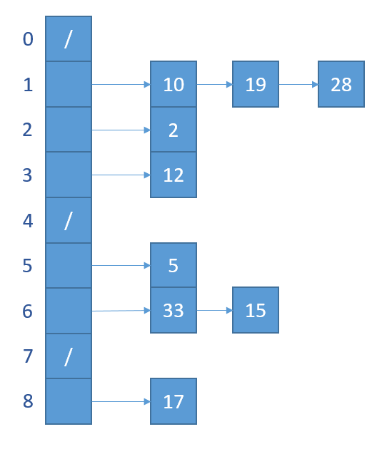

## 11.2 Hash tables

### 11.2-1

> Suppose we use a hash function $$h$$ to hash $$n$$ distinct keys into an array $$T$$ of length $$m$$. Assuming simple uniform hashing, what is the expected number of collisions? More precisely, what is the expected cardinality of $$\{\{k,l\}:k\ne l~\text{and}~h(k)=h(l)\}$$?

$$\text{Pr}\{h(k_i)=h(k_j)\}=1/m$$

$$X_{ij}=\text{I}\{h(k_i)=h(k_j)\}$$

$$\text{E}[X_{ij}]=1/m$$

$$\begin{array}{rll}
\text{E}[\{\{k,l\}:k\ne l~\text{and}~h(k)=h(l)\}] 
&=& \displaystyle \sum_{i=1}^n \sum_{j=i+1}^n \text{E}[X_{ij}] \\
&=& \displaystyle \sum_{i=1}^n \sum_{j=i+1}^n \frac{1}{m} \\
&=& \displaystyle \frac{n(n-1)}{2m}
\end{array}
$$

### 11.2-2

> Demonstrate what happens when we insert the keys 5, 28, 19, 15, 20, 33, 12, 17, 10 into a hash table with collisions resolved by chaining. Let the table have 9 slots, and let the hash function be $$h(k) = k$$ mod 9.

### 11.2-3

> Professor Marley hypothesizes that he can obtain substantial performance gains by modifying the chaining scheme to keep each list in sorted order. How does the professor's modification affect the running time for successful searches, unsuccessful searches, insertions, and deletions?

Successful searches: no difference, $$\Theta(1+\alpha)$$.

Unsuccessful searches: faster but still $$\Theta(1+\alpha)$$.

Insertions: same as successful searches, $$\Theta(1+\alpha)$$.

Deletions: same as successful searches, $$\Theta(1+\alpha)$$.

### 11.2-4

> Suggest how to allocate and deallocate storage for elements within the hash table itself by linking all unused slots into a free list. Assume that one slot can store a flag and either one element plus a pointer or two pointers. All dictionary and free-list operations should run in $$O(1)$$ expected time. Does the free list need to be doubly linked, or does a singly linked free list suffice?

Flag: free or used.

If the slot is free, it contains two pointers point to the previous and the next free slots.

If the slot is used, it contains an element the the pointer to the next element with the same key.

We have to use a doubly linked list since we need $$\Theta(1)$$ deletion.

### 11.2-5

> Suppose that we are storing a set of $$n$$ keys into a hash table of size $$m$$. Show that if the keys are drawn from a universe $$U$$ with $$|U| > nm$$, then $$U$$ has a subset of size $$n$$ consisting of keys that all hash to the same slot, so that the worst-case searching time for hashing with chaining is $$\Theta(n)$$.

Suppose the $$m-1$$ slots contains at most $$n-1$$ elements, then the remaining slot should have $$|U| - (m-1)(n-1) $$ $$> nm - (m-1)(n-1) $$ $$= n + m - 1$$ $$\ge n$$ elements, thus $$U$$ has a subset of size $$n$$.

### 11.2-6

> Suppose we have stored $$n$$ keys in a hash table of size $$m$$, with collisions resolved by chaining, and that we know the length of each chain, including the length $$L$$ of the longest chain. Describe a procedure that selects a key uniformly at random from among the keys in the hash table and returns it in expected time $$O(L \cdot (1 + 1/\alpha))$$.

Select a random key $$k$$ and select a random number $$l$$ such that $$1 \le l \le L$$. If $$l \le n_k$$, the selected element is returned, otherwise repeat the procedure until we find an existing element.

$$\text{Pr}\{ \text{the selected element exists} \} = \alpha / L$$

$$\text{E}[\text{number of attempts}] = L / \alpha$$

When we find an existing element, we need $$O(L)$$ time to iterate to the element, thus the expected time is:

$$O(L / \alpha + L) = O(L \cdot (1 + 1/\alpha))$$
