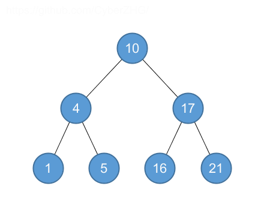
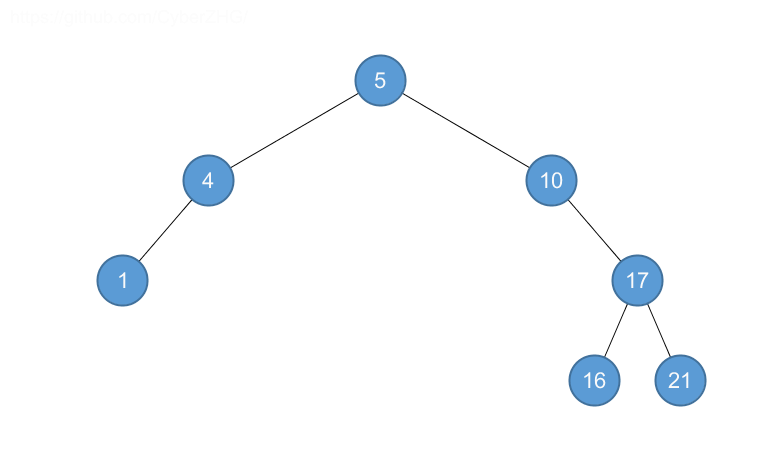
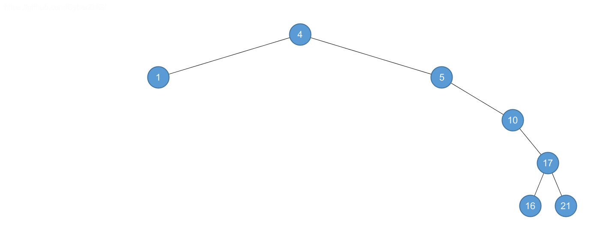
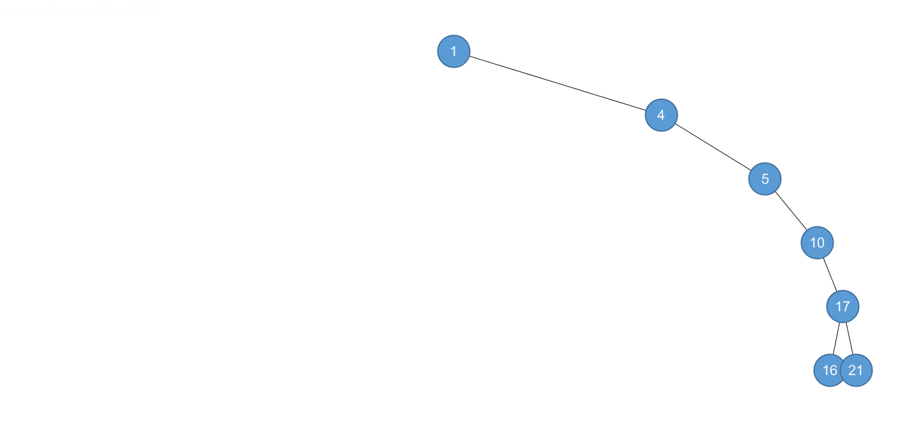
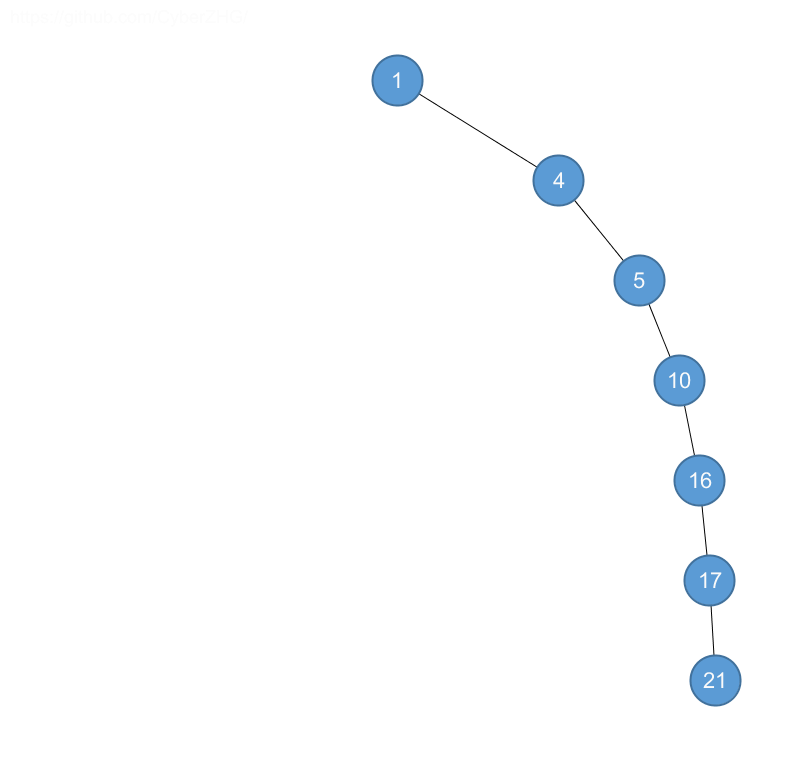

## 12.1 What is a binary search tree?

### 12.1-1

> For the set of $$\langle 1, 4, 5, 10, 16, 17, 21 \rangle$$ of keys, draw binary search trees of heights $$2$$, $$3$$, $$4$$, $$5$$, and $$6$$.











### 12.1-2

> What is the difference between the binary-search-tree property and the min-heap property (see page 153)? Can the min-heap property be used to print out the keys of an $$n$$-node tree in sorted order in $$O(n)$$ time? Show how, or explain why not.

No, heap needs $$O(n \lg n)$$ time.

### 12.1-3

> Give a nonrecursive algorithm that performs an inorder tree walk.

```python
class TreeNode:
    def __init__(self, val, left=None, right=None):
        self.val = val
        self.left = left
        self.right = right


def inorder_tree_walk(root):
    stack = []
    while len(stack) > 0 or root is not None:
        if root is None:
            root = stack[-1]
            del stack[-1]
            print(root.val)
            root = root.right
        else:
            stack.append(root)
            root = root.left
```

### 12.1-4

> Give recursive algorithms that perform preorder and postorder tree walks in $$\Theta(n)$$ time on a tree of $$n$$ nodes.

```python
class TreeNode:
    def __init__(self, val, left=None, right=None):
        self.val = val
        self.left = left
        self.right = right


def preorder_tree_walk(root):
    if root is not None:
        print(root.val)
        preorder_tree_walk(root.left)
        preorder_tree_walk(root.right)


def postorder_tree_walk(root):
    if root is not None:
        postorder_tree_walk(root.left)
        postorder_tree_walk(root.right)
        print(root.val)
```

### 12.1-5

> Argue that since sorting $$n$$ elements takes $$\Omega(n \lg n)$$ time in the worst case in the comparison model, any comparison-based algorithm for constructing a binary search tree from an arbitrary list of $$n$$ elements takes $$\Omega(n \lg n)$$ time in the worst case.

If we construct the binary search tree by comparison-based algorithm using less than $$\Omega(n \lg n)$$ time, since the inorder tree walk is $$\Theta(n)$$, then we can get the sorted elements in less than $$\Omega(n \lg n)$$ time, which contradicts the fact that sorting $$n$$ elements takes $$\Omega(n \lg n)$$ time in the worst case.
