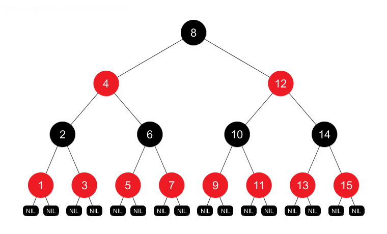
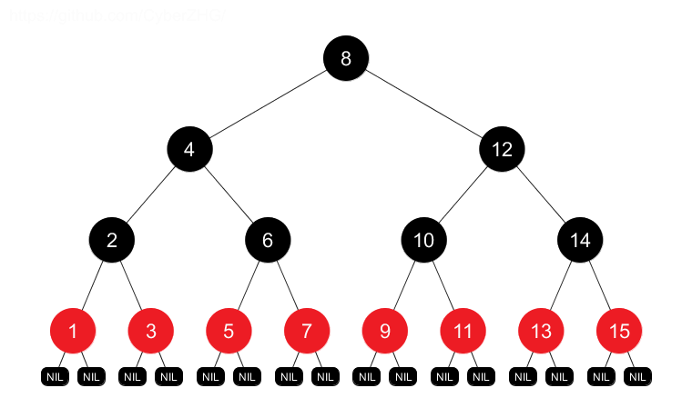
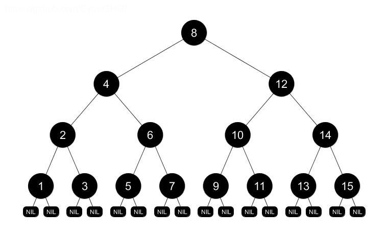
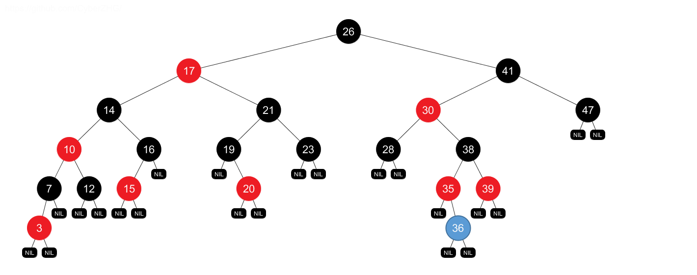

## 13.1 Properties of red-black trees

### 13.1-1

> In the style of Figure 13.1(a), draw the complete binary search tree of height 3 on the keys $$\{1,2, \dots ,15\}$$. Add the NIL leaves and color the nodes in three different ways such that the black-heights of the resulting red-black trees are 2, 3, and 4.

### 13.1-2

> Draw the red-black tree that results after TREE-INSERT is called on the tree in Figure 13.1 with key 36. If the inserted node is colored red, is the resulting tree a red-black tree? What if it is colored black?

If it is colored red, the tree doesn't satisfy property 4.

If it is colored black, the tree doesn't satisfy property 5.

### 13.1-3

> Let us define a __*relaxed red-black*__ tree as a binary search tree that satisfies red-black properties 1, 3, 4, and 5. In other words, the root may be either red or black. Consider a relaxed red-black tree $$T$$ whose root is red. If we color the root of $$T$$ black but make no other changes to $$T$$, is the resulting tree a red-black tree?

Obviously properties 1, 2, 3, 4 are satisfied.

Changing the root from red to black increases the number of black nodes in each path by 1, therefore they still have the same number of black nodes.

The resulting tree is a red-black tree.

### 13.1-4

> Suppose that we "absorb" every red node in a red-black tree into its black parent, so that the children of the red node become children of the black parent. (Ignore what happens to the keys.) What are the possible degrees of a black node after all its red children are absorbed? What can you say about the depths of the leaves of the resulting tree?

The degree could be 2, 3, 4.

All the leaves have the same depth.

### 13.1-5

> Show that the longest simple path from a node $$x$$ in a red-black tree to a descendant leaf has length at most twice that of the shortest simple path from node $$x$$ to a descendant leaf.

Since the paths contain the same number of black nodes $$hb(x)$$, we can insert one red node after each black nodes in a simple path and property 4 is satisfied, the resulting length is $$2hb(x)$$.

### 13.1-6

> What is the largest possible number of internal nodes in a red-black tree with black-height $$k$$? What is the smallest possible number?

The largest is the complete binary tree with height $$2k$$, which has $$2^{2k} - 1$$ internal nodes.

The smallest is a black chain with length $$k$$, which has $$k$$ internal nodes.

### 13.1-7

> Describe a red-black tree on $$n$$ keys that realizes the largest possible ratio of red internal nodes to black internal nodes. What is this ratio? What tree has the smallest possible ratio, and what is the ratio?

The largest ratio is 2, each black node has two red children.

The smallest ratio is 0.
