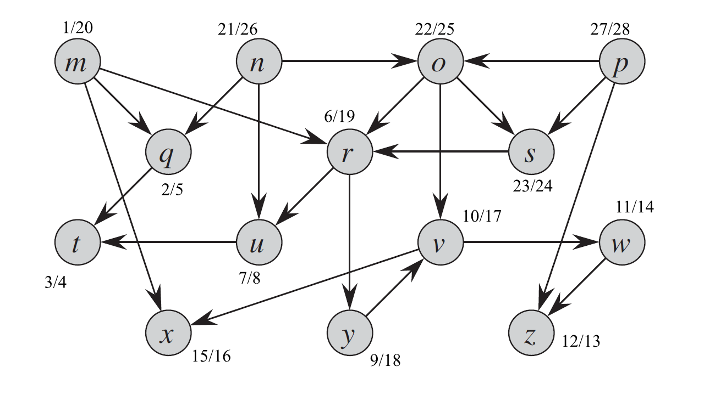

## 22.4 Topological sort

### 22.4-1

> Show the ordering of vertices produced by TOPOLOGICAL-SORT when it is run on the dag of Figure 22.8, under the assumption of Exercise 22.3-2.

p, n, o, s, m, r, y, v, x, w, z, u, q, t.

### 22.4-2

> Give a linear-time algorithm that takes as input a directed acyclic graph $$G = (V, E)$$ and two vertices $$s$$ and $$t$$, and returns the number of simple paths from $$s$$ to $$t$$ in $$G$$. For example, the directed acyclic graph of Figure 22.8 contains exactly four simple paths from vertex $$p$$ to vertex $$v$$: $$pov$$, $$poryv$$, $$posryv$$, and $$psryv$$. (Your algorithm needs only to count the simple paths, not list them.)

Topological sort + dynamic programming.

### 22.4-3

> Give an algorithm that determines whether or not a given undirected graph $$G = (V, E)$$ contains a cycle. Your algorithm should run in $$O(V)$$ time, independent of $$|E|$$.

Undirected + acyclic -> forest.

DFS, if there is a back edge, then it contains cycle. At most $$|V| - 1$$ edges are needed to examine since there are at most $$|V| - 1$$ edges in the forest.

### 22.4-4
 
> Prove or disprove: If a directed graph $$G$$ contains cycles, then TOPOLOGICAL-SORT$$(G)$$ produces a vertex ordering that minimizes the number of "bad" edges that are inconsistent with the ordering produced.

$$E = \{ (a, b), (b, c), (c, b), (c, a) \}$$

Bad edges if begins from $$b$$: $$(c, b), (a, b)$$.
Bad edge if begins from $$c$$: $$(b, c)$$.

The number of bad edges depends on the ordering of DFS.

### 22.4-5

> Another way to perform topological sorting on a directed acyclic graph $$G = (V, E)$$ is to repeatedly find a vertex of in-degree $$0$$, output it, and remove it and all of its outgoing edges from the graph. Explain how to implement this idea so that it runs in time $$O(V + E)$$. What happens to this algorithm if $$G$$ has cycles?

Maintain the in-degrees of the nodes. If the in-degree is 0, then add the node to a queue. When removing a node, all the nodes it connects to should subtract their in-degrees by 1.

