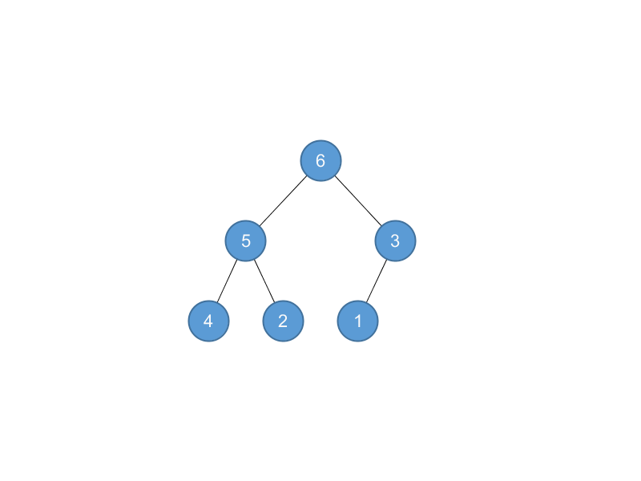

## Problems

### 6-1 Building a heap using insertion

> We can build a heap by repeatedly calling MAX-HEAP-INSERT to insert the elements into the heap. Consider the following variation on the BUILD-MAX-HEAP procedure:

> ```
BUILD-MAX-HEAP'(A)
1 A.heap-size = 1
2 for i = 2 to A.length
3     MAX-HEAP-INSERT(A, A[i])
```

> __*a*__. Do the procedures BUILD-MAX-HEAP and BUILD-MAX-HEAP' always create the same heap when run on the same input array? Prove that they do, or provide a counterexample.

No. 

For $\left \langle 1, 2, 3, 4, 5, 6\right \rangle$, 

BUILD-MAX-HEAP: $\left \langle 6,4,5,1,3,2 \right \rangle$;


BUILD-MAX-HEAP': $\left \langle 6,5,3,4,2,1 \right \rangle$.



> __*b*__. Show that in the worst case, BUILD-MAX-HEAP' requires $\Theta(n\lg n)$ time to build an n-element heap.

MAX-HEAP-INSERT is $\Theta(\lg n)$, thus BUILD-MAX-HEAP' is $\Theta(n \lg n)$.

### 6-2 Analysis of $d$-ary heaps

> A $d$-ary heap is like a binary heap, but (with one possible exception) non-leaf nodes have $d$ children instead of $2$ children.

> __*a*__. How would you represent a $d$-ary heap in an array?

If the index of the array begins with 0, then the $k$th children of node $i$ is $id+k$. The parent of node $i$ is $\displaystyle \left \lfloor \frac{i - 1}{d} \right \rfloor$.

Thus if the index begins with 1, the $k$th children is $(i-1)d+k+1$, the parent is $\displaystyle \left \lfloor \frac{i-2}{d} \right \rfloor + 1$.

> __*b*__. What is the height of a $d$-ary heap of $n$ elements in terms of $n$ and $d$?

$\log_dn$

> __*c*__. Give an efficient implementation of EXTRACT-MAX in a $d$-ary max-heap. Analyze its running time in terms of $d$ and $n$.

$\Theta(d \log_dn)$

```python
def parent(d, i):
    return (i - 1) / d


def child(d, i, k):
    return (i * d) + k


def max_heapify(d, a, i):
    max_idx = i
    for k in range(1, d + 1):
        c = child(d, i, k)
        if c < len(a) and a[c] > a[max_idx]:
            max_idx = c
    if max_idx != i:
        a[i], a[max_idx] = a[max_idx], a[i]
        max_heapify(d, a, max_idx)


def extract_max(d, a):
    assert(len(a) > 0)
    val = a[0]
    a[0] = a[-1]
    del a[-1]
    max_heapify(d, a, 0)
    return val
```

> __*d*__. Give an efficient implementation of INSERT in a $d$-ary max-heap. Analyze its running time in terms of $d$ and $n$.

$\Theta(\log_dn)$

```python
def increase_key(d, a, i, key):
    assert(key >= a[i])
    while i > 0 and key > a[parent(d, i)]:
        a[i] = a[parent(d, i)]
        i = parent(d, i)
    a[i] = key


def insert(d, a, key):
    a.append(-1e100)
    increase_key(d, a, len(a) - 1, key)
```

> __*e*__. Give an efficient implementation of INCREASE-KEY$(A, i, k)$, which flags an error if $k < A[i]$, but otherwise sets $A[i] = k$ and then updates the $d$-ary maxheap structure appropriately. Analyze its running time in terms of $d$ and $n$.

$\Theta(\log_dn)$

```python
def increase_key(d, a, i, key):
    assert(key >= a[i])
    while i > 0 and key > a[parent(d, i)]:
        a[i] = a[parent(d, i)]
        i = parent(d, i)
    a[i] = key
```

### 6-3 Young tableaus

> An $m \times n$ __*Young tableau*__ is an $m \times n$ matrix such that the entries of each row are in sorted order from left to right and the entries of each column are in sorted order from top to bottom. Some of the entries of a Young tableau may be $\infty$, which we treat as nonexistent elements. Thus, a Young tableau can be used to hold $r \le mn$ finite numbers.

> __*a*__. Draw a $4\times4$ Young tableau containing the elements $\left \{ 9, 16, 3, 2, 4, 8, 5, 14, 12\right \}$.

$
\begin{matrix}
2 & 3 & 4 & 5 \\
8 & 9 & 12 & 14 \\
16 & \infty & \infty & \infty \\
\infty & \infty & \infty & \infty \\
\end{matrix}
$

> __*b*__. Argue that an $m \times n$ Young tableau $Y$ is empty if $Y[1, 1] = \infty$. Argue that $Y$ is full (contains $mn$ elements) if $Y[m,n] < \infty$.

Transitive.

> __*c*__. Give an algorithm to implement EXTRACT-MIN on a nonempty $m \times n$ Young tableau that runs in $O(m+n)$ time. Your algorithm should use a recursive subroutine that solves an $m \times n$ problem by recursively solving either an $(m-1) \times n$ or an $m \times (n - 1)$ subproblem. Define $T(p)$, where $p=m+n$, to be the maximum running time of EXTRACT-MIN on any $m \times n$ Young tableau. Give and solve a recurrence for $T(p)$ that yields the $O(m + n)$ time bound.

```python
def extract_min(a):
    m, n = len(a), len(a[0])
    val = a[0][0]
    a[0][0] = 1e8

    def maintain(i, j):
        min_i, min_j = i, j
        if i + 1 < m and a[i + 1][j] < a[min_i][min_j]:
            min_i, min_j = i + 1, j
        if j + 1 < n and a[i][j + 1] < a[min_i][min_j]:
            min_i, min_j = i, j + 1
        if min_i != i or min_j != j:
            a[i][j], a[min_i][min_j] = a[min_i][min_j], a[i][j]
            maintain(min_i, min_j)

    maintain(0, 0)
    return val
```

$
T(n) = T(n - 1) + O(1)
$

> __*d*__. Show how to insert a new element into a nonfull $m \times n$ Young tableau in $O(m + n)$ time.


```python
def insert(a, val):
    m, n = len(a), len(a[0])
    a[m - 1][n - 1] = val

    def maintain(i, j):
        max_i, max_j = i, j
        if i - 1 >= 0 and a[i - 1][j] > a[max_i][max_j]:
            max_i, max_j = i - 1, j
        if j - 1 >= 0 and a[i][j - 1] > a[max_i][max_j]:
            max_i, max_j = i, j - 1
        if max_i != i or max_j != j:
            a[i][j], a[max_i][max_j] = a[max_i][max_j], a[i][j]
            maintain(max_i, max_j)

    maintain(m - 1, n - 1)
```

> __*e*__. Using no other sorting method as a subroutine, show how to use an $n \times n$ Young tableau to sort $n^2$ numbers in $O(n^3)$ time.

```python
def sort_elements(a):
    m = len(a)
    n = int(math.ceil(math.sqrt(m)))
    y = [[1e8 for _ in range(n)] for _ in range(n)]
    for val in a:
        insert(y, val)
    a = []
    for _ in range(m):
        a.append(extract_min(y))
    return a
```

INSERT and EXTRACT-MIN are $O(n)$, there are $n^2$ elements, therefore the result is $O(n^3)$.


> __*f*__. Give an $O(m + n)$-time algorithm to determine whether a given number is stored in a given $m \times n$ Young tableau.

```python
def find(a, val):
    m, n = len(a), len(a[0])
    i, j = 0, n - 1
    while i < m and j >= 0:
        if a[i][j] == val:
            return i, j
        elif a[i][j] > val:
            j -= 1
        else:
            i += 1
    return -1, -1
```
