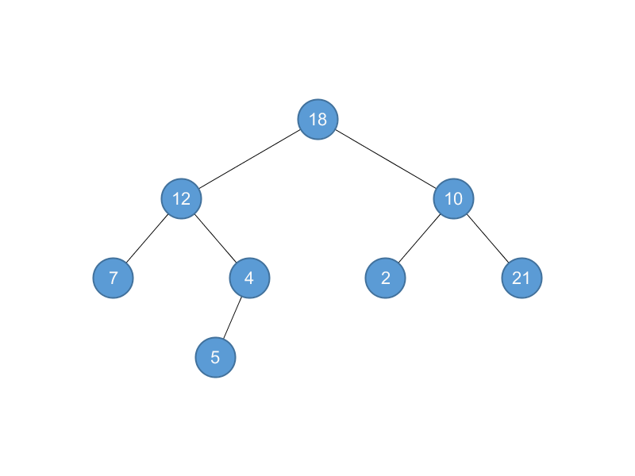

## 10.4 Representing rooted trees

### 10.4-1

> Draw the binary tree rooted at index 6 that is represented by the following attributes:

> |index|key|left|right|
|-|-|-|-|
|1|12|7|3|
|2|15|8|NIL|
|3|4|10|NIL|
|4|10|5|9|
|5|2|NIL|NIL|
|6|18|1|4|
|7|7|NIL|NIL|
|8|14|6|2|
|9|21|NIL|NIL|
|10|5|NIL|NIL|



### 10.4-2

> Write an $$O(n)$$-time recursive procedure that, given an $$n$$-node binary tree, prints out the key of each node in the tree.

```python
class TreeNode:
    def __init__(self, value, left=None, right=None):
        self.value = value
        self.left = left
        self.right = right


def print_tree(node):
    if node is not None:
        print(node.value)
        print_tree(node.left)
        print_tree(node.right)
```

### 10.4-3

> Write an O$$(n)$$-time nonrecursive procedure that, given an $$n$$-node binary tree, prints out the key of each node in the tree. Use a stack as an auxiliary data structure.

```python
class TreeNode:
    def __init__(self, value, left=None, right=None):
        self.value = value
        self.left = left
        self.right = right


def print_tree(node):
    stack = [node]
    while len(stack) > 0:
        node = stack[-1]
        del stack[-1]
        if node is not None:
            print(node.value)
            stack.append(node.left)
            stack.append(node.right)
```

### 10.4-4

> Write an $$O(n)$$-time procedure that prints all the keys of an arbitrary rooted tree with $$n$$ nodes, where the tree is stored using the left-child, right-sibling representation.

```python
class TreeNode:
    def __init__(self, value, parent=None, left=None, right=None):
        self.value = value
        self.parent = parent
        self.left_child = left
        self.right_sibling = right


def print_tree(node):
    if node is not None:
        while node.parent is not None:
            node = node.parent
        while node is not None:
            print(node.value)
            sibling = node.right_sibling
            while sibling is not None:
                print(sibling.value)
                sibling = sibling.right_sibling
            node = node.left_child
```

### 10.4-5 $$\star$$

> Write an $$O(n)$$-time nonrecursive procedure that, given an $$n$$-node binary tree, prints out the key of each node. Use no more than constant extra space outside of the tree itself and do not modify the tree, even temporarily, during the procedure.

```python
class TreeNode:
    def __init__(self, value, left=None, right=None):
        self.value = value
        self.parent = None
        self.left = left
        self.right = right
        if left is not None:
            left.parent = self
        if right is not None:
            right.parent = self


def print_tree(node):
    prev = None
    while node is not None:
        if node.parent == prev:
            print(node.value)
            prev = node
            if node.left is None:
                node = node.parent
            else:
                node = node.left
        elif node.left == prev:
            prev = node
            if node.right is None:
                node = node.parent
            else:
                node = node.right
        else:
            prev = node
            node = node.parent
```

### 10.4-6 $$\star$$

> The left-child, right-sibling representation of an arbitrary rooted tree uses three pointers in each node: _left-child_, _right-sibling_, and _parent_. From any node, its parent can be reached and identified in constant time and all its children can be reached and identified in time linear in the number of children. Show how to use only two pointers and one boolean value in each node so that the parent of a node or all of its children can be reached and identified in time linear in the number of children.

Use boolean to identify the last sibling, and the last sibling's right-sibling points to the parent.

