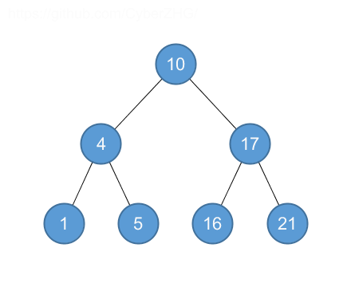
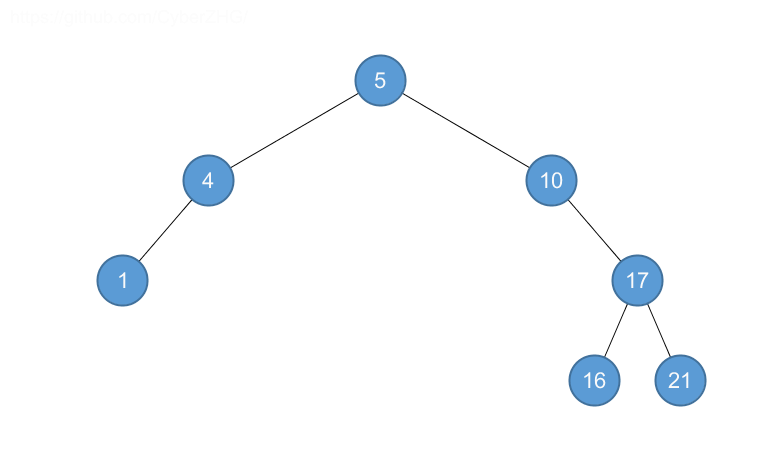
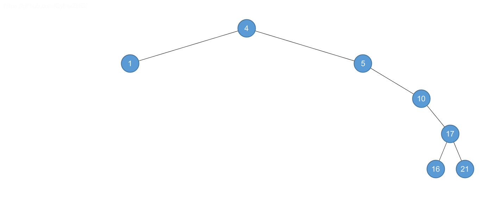
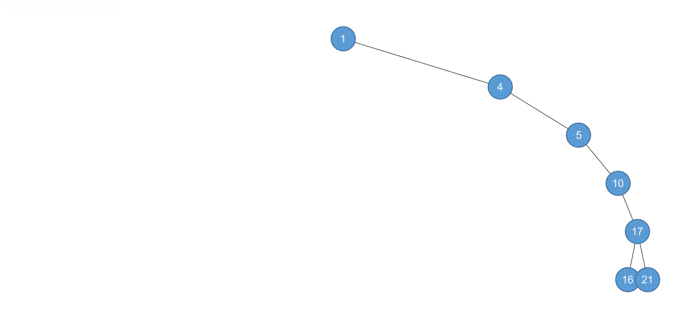
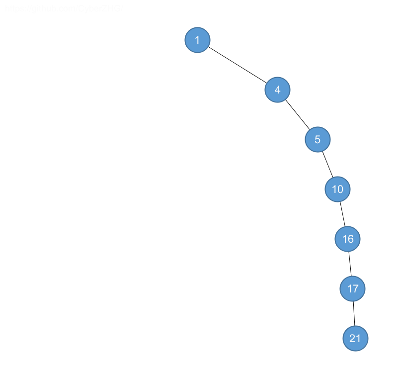

## 12.1 What is a binary search tree?

### 12.1-1

> For the set of $$\langle 1, 4, 5, 10, 16, 17, 21 \rangle$$ of keys, draw binary search trees of heights $$2$$, $$3$$, $$4$$, $$5$$, and $$6$$.

