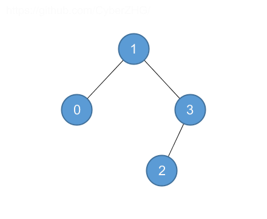
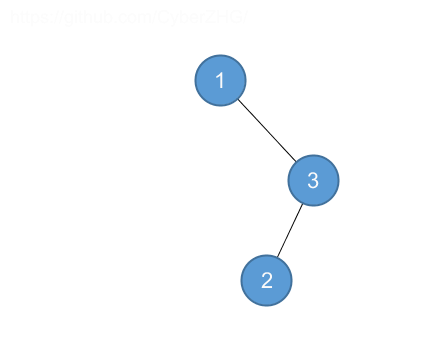
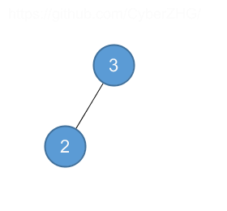
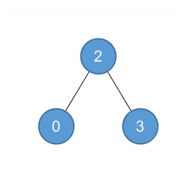
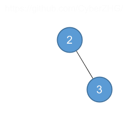

## 12.3 Insertion and deletion

### 12.3-1

> Give a recursive version of the TREE-INSERT procedure.

```python
class TreeNode:
    def __init__(self, val, left=None, right=None):
        self.val = val
        self.parent = None
        self.left = left
        self.right = right
        if left is not None:
            left.parent = self
        if right is not None:
            right.parent = self


def insert(root, x):
    if root is None:
        return TreeNode(x)
    if root.val > x:
        root.left = insert(root.left, x)
        root.left.parent = root
    elif root.val < x:
        root.right = insert(root.right, x)
        root.right.parent = root
    return root
```

### 12.3-2

> Suppose that we construct a binary search tree by repeatedly inserting distinct values into the tree. Argue that the number of nodes examined in searching for a value in the tree is one plus the number of nodes examined when the value was first inserted into the tree.

Obviously

### 12.3-3

> We can sort a given set of $$n$$ numbers by first building a binary search tree containing these numbers (using TREE-INSERT repeatedly to insert the numbers one by one) and then printing the numbers by an inorder tree walk. What are the worstcase and best-case running times for this sorting algorithm?

Worst: chain, $$O(n^2)$$.

Best: $$\Theta(n \lg n)$$.

### 12.3-4

> Is the operation of deletion "commutative" in the sense that deleting $$x$$ and then $$y$$ from a binary search tree leaves the same tree as deleting $$y$$ and then $$x$$? Argue why it is or give a counterexample.

No.



Delete 0 then delete 1:




Delete 1 then delete 0:




### 12.3-5

> Suppose that instead of each node $$x$$ keeping the attribute $$x.p$$, pointing to $$x$$'s parent, it keeps $$x.succ$$, pointing to $$x$$'s successor. Give pseudocode for SEARCH, INSERT, and DELETE on a binary search tree $$T$$ using this representation. These procedures should operate in time $$O(h)$$, where $$h$$ is the height of the tree $$T$$.

In SEARCH and INSERT, we do not need to know the parent of $$x$$.

```python
def get_parent(root, node):
    if node is None:
        return None
    a = tree_successor(tree_maximum(node))
    if a is None:
        a = root
    else:
        if a.left == node:
            return a
        a = a.left
    while a is not None and a.right != node:
        a = a.right
    return a
```

Therefore we can find $$x$$'s parent in $$O(h)$$, DELETE is $$O(h + h) = O(h)$$.

### 12.3-6

> When node $$z$$ in TREE-DELETE has two children, we could choose node $$y$$ as its predecessor rather than its successor. What other changes to TREE-DELETE would be necessary if we did so? Some have argued that a fair strategy, giving equal priority to predecessor and successor, yields better empirical performance. How might TREE-DELETE be changed to implement such a fair strategy?

Randomly choose predecessor and successor.
