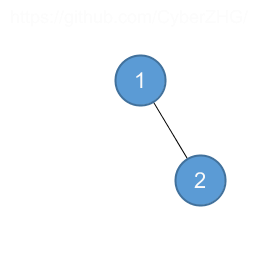
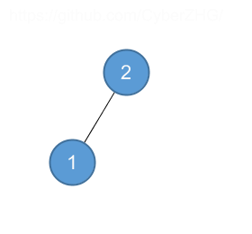

## 13.2 Rotations

### 13.2-1

> Write pseudocode for RIGHT-ROTATE.

```
RIGHT-ROTATE(T, y)
 1  x = y.left
 2  y.left = x.right
 3  if x.right != T.nil
 4      x.right.p = y
 5  x.p = y.p
 6  if y.p == T.nil
 7      T.root = x
 8  elseif y == y.p.right
 9      y.p.right = x
10  else y.p.left = x
11  x.right = y
12  y.p = x
```

### 13.2-2

> Argue that in every $$n$$-node binary search tree, there are exactly $$n - 1$$ possible rotations.

Every node can rotate with its parent, only the root does not have a parent, therefore there are $$n - 1$$ possible rotations.

### 13.2-3

> Let $$a$$, $$b$$, and $$c$$ be arbitrary nodes in subtrees $$\alpha$$, $$\beta$$, and $$\gamma$$, respectively, in the left tree of Figure 13.2. How do the depths of $$a$$, $$b$$, and $$c$$ change when a left rotation is performed on node $$x$$ in the figure?

$$a$$: increase by 1.

$$b$$: unchanged.

$$c$$: decrease by 1.

### 13.2-4

> Show that any arbitrary $$n$$-node binary search tree can be transformed into any other arbitrary $$n$$-node binary search tree using $$O(n)$$ rotations.

For each left leaf, we perform right rotation until there is no left leaf. We need at most $$n-1$$ right rotations to transform the tree into a right-going chain. 

Since we can transform every tree into a right-going chain, and the operation is invertible, therefore we can transform one tree into the right-going chain and use the inverse operation to construct the other tree.

### 13.2-5 $$\star$$

> We say that a binary search tree $$T_1$$ can be right-converted to binary search tree $$T_2$$ if it is possible to obtain $$T_2$$ from $$T_1$$ via a series of calls to RIGHT-ROTATE. Give an example of two trees $$T_1$$ and $$T_2$$ such that $$T_1$$ cannot be right-converted to $$T_2$$. Then, show that if a tree $$T_1$$ can be right-converted to $$T_2$$, it can be right-converted using $$O(n^2)$$ calls to RIGHT-ROTATE.

 

We can use $$O(n)$$ calls to rotate the node which is the root in $$T_2$$ to $$T_1$$'s root, then use the same operation in the two subtrees. There are $$n$$ nodes, therefore the upper bound is $$O(n^2)$$.
