## 13.3 Insertion

### 13.3-1

> In line 16 of RB-INSERT, we set the color of the newly inserted node $$z$$ to red. Observe that if we had chosen to set $$z$$'s color to black, then property 4 of a red-black tree would not be violated. Why didn’t we choose to set $$z$$'s color to black?

Violate property 5.

### 13.3-2

> Show the red-black trees that result after successively inserting the keys $$41, 38, 31, 12, 19, 8$$ into an initially empty red-black tree.

Insert 41:

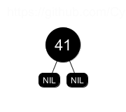

Insert 38:

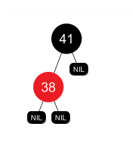

Insert 31:

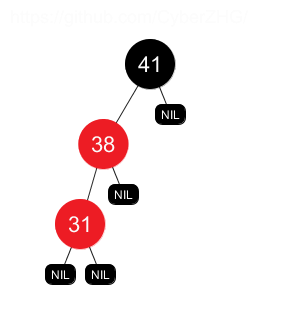

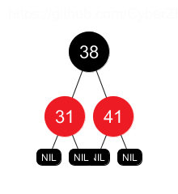

Insert 12:

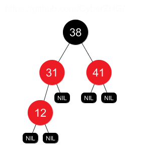

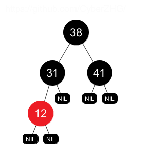

Insert 19:

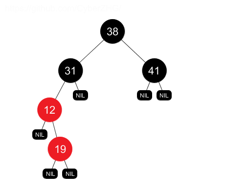

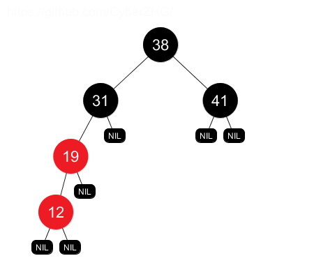

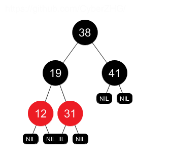

Insert 8:

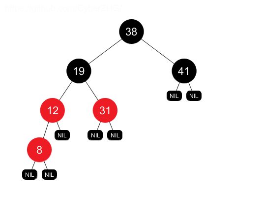

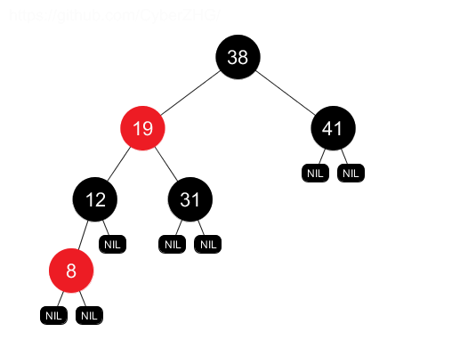

### 13.3-3

> Suppose that the black-height of each of the subtrees $$\alpha, \beta, \gamma, \delta, \epsilon$$ in Figures 13.5 and 13.6 is $$k$$. Label each node in each figure with its black-height to verify that the indicated transformation preserves property 5.

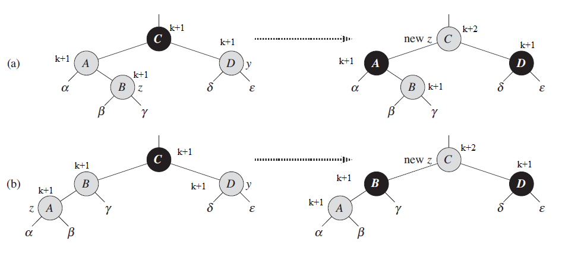

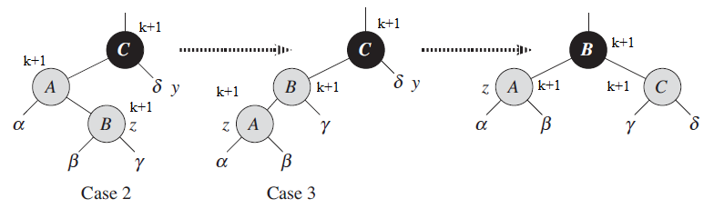

### 13.3-4

> Professor Teach is concerned that RB-INSERT-FIXUP might set $$T.nil.color$$ to RED, in which case the test in line 1 would not cause the loop to terminate when $$z$$ is the root. Show that the professor's concern is unfounded by arguing that RBINSERT-FIXUP never sets $$T.nil.color$$ to RED.

In order to set $$T.nil.color$$ to RED, $$z.p$$ must be the root; and if $$z.p$$ is the root, then $$z.p$$ is black, the loop terminates. 

### 13.3-5

> Consider a red-black tree formed by inserting $$n$$ nodes with RB-INSERT. Argue that if $$n > 1$$, the tree has at least one red node.

In case 1, $$z$$ and $$z.p.p$$ are RED, if the loop terminates, then $$z$$ could not be the root, thus $$z$$ is RED after the fix up.

In case 2, $$z$$ and $$z.p$$ are RED, and after the rotation $$z.p$$ could not be the root, thus $$z.p$$ is RED after the fix up.

In case 3, $$z$$ is RED and $$z$$ could not be the root, thus $$z$$ is RED after the fix up.

Therefore, there is always at least one red node.

### 13.3-6

> Suggest how to implement RB-INSERT efficiently if the representation for red-black trees includes no storage for parent pointers.

Use stack to record the path to the inserted node, then parent is the top element in the stack.

In case 1, we pop $$z.p$$ and $$z.p.p$$.

In case 2, we pop $$z.p$$ and $$z.p.p$$, then push $$z.p.p$$ and $$z$$.

In case 3, we pop $$z.p$$, $$z.p.p$$ and $$z.p.p.p$$, then push $$z.p$$.
