## 13.4 Deletion

### 13.4-1

> Argue that after executing RB-DELETE-FIXUP, the root of the tree must be black.

Case 1, transform to 2, 3, 4.

Case 2, if terminates, the root of the subtree (the new $$x$$) is set to black.

Case 3, transform to 4.

Case 4, the root (the new $$x$$) is set to black.

### 13.4-2

> Argue that if in RB-DELETE both $$x$$ and $$x.p$$ are red, then property 4 is restored by the call to RB-DELETE-FIXUP$$(T, x)$$.

Will not enter the loop, $$x$$ is set to black.

### 13.4-3

> In Exercise 13.3-2, you found the red-black tree that results from successively inserting the keys $$41, 38, 31, 12, 19, 8$$ into an initially empty tree. Now show the red-black trees that result from the successive deletion of the keys in the order $$8, 12, 19, 31, 38, 41$$.

Delete 8:

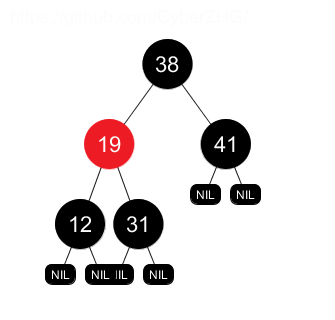

Delete 12:

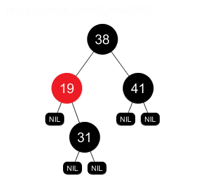
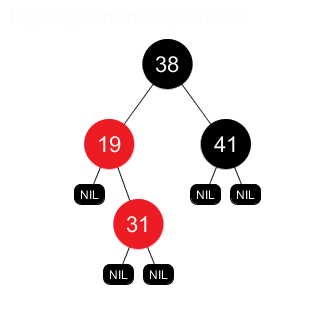
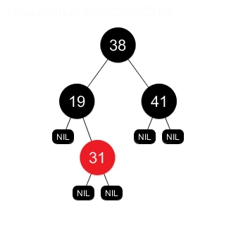

Delete 19:

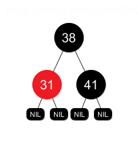
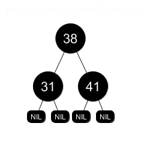

Delete 31:

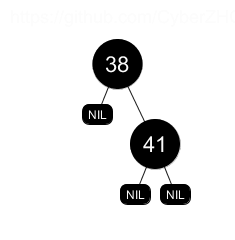
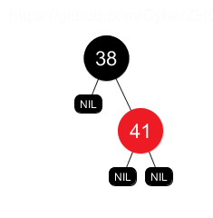

Delete 38:

Delete 41.

### 13.4-4

> In which lines of the code for RB-DELETE-FIXUP might we examine or modify
the sentinel $$T.nil$$?

Line 1, 2.

### 13.4-5

> In each of the cases of Figure 13.7, give the count of black nodes from the root of the subtree shown to each of the subtrees $$\alpha, \beta, \dots, \zeta$$, and verify that each count remains the same after the transformation. When a node has a color attribute $$c$$ or $$c'$$, use the notation count$$(c)$$ or count$$(c')$$ symbolically in your count.

$$\dots$$

### 13.4-6

> Professors Skelton and Baron are concerned that at the start of case 1 of RBDELETE-FIXUP, the node $$x.p$$ might not be black. If the professors are correct, then lines 5–6 are wrong. Show that $$x.p$$ must be black at the start of case 1, so that the professors have nothing to worry about.

Since $$w$$ is red, based on property 4, $$x.p$$ must be black.

### 13.4-7

> Suppose that a node $$x$$ is inserted into a red-black tree with RB-INSERT and then is immediately deleted with RB-DELETE. Is the resulting red-black tree the same as the initial red-black tree? Justify your answer.

No. 

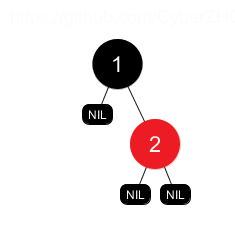

Insert 3:

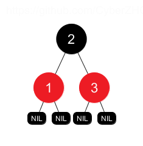

Delete 3:

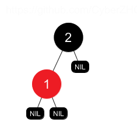
