## 18.2 Basic operations on B-trees

### 18.2-1

> Show the results of inserting the keys 

> $F, S, Q, K, C, L, H, T, V, W, M, R, N, P, A, B, X, Y, D, Z, E$

> in order into an empty B-tree with minimum degree 2. Draw only the configurations of the tree just before some node must split, and also draw the final configuration.


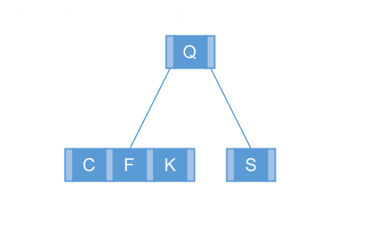

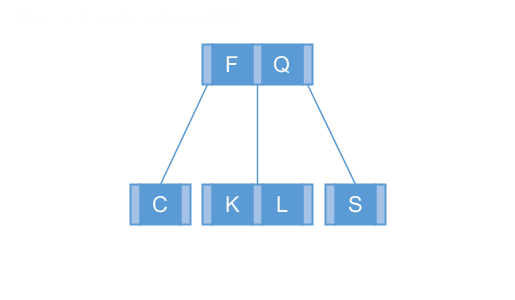

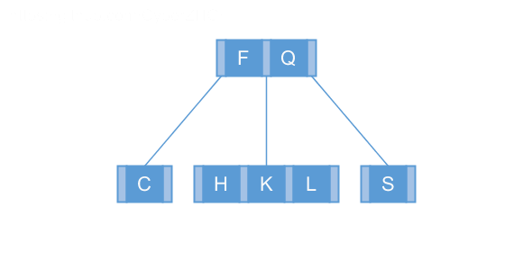

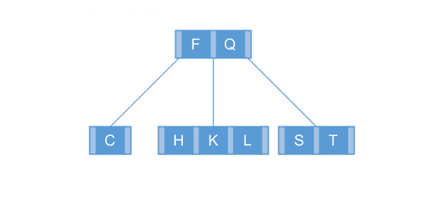

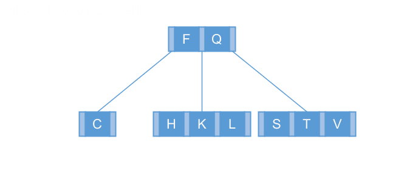

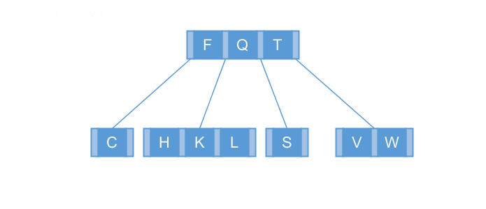

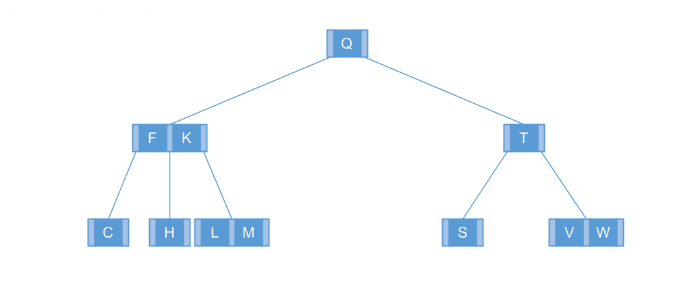

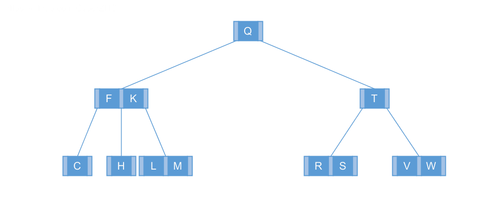

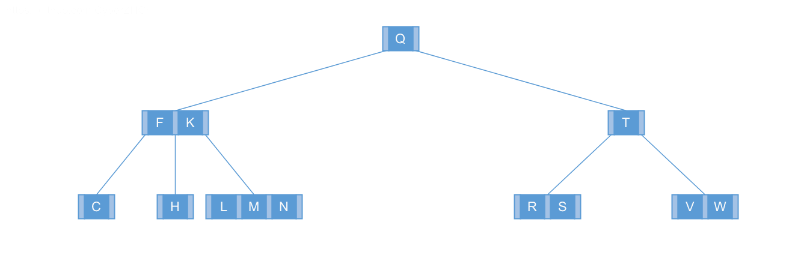

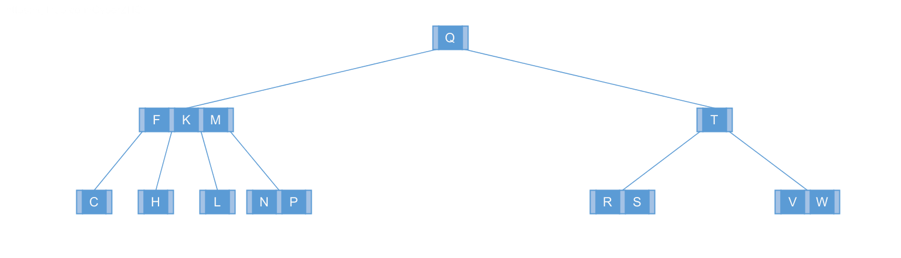

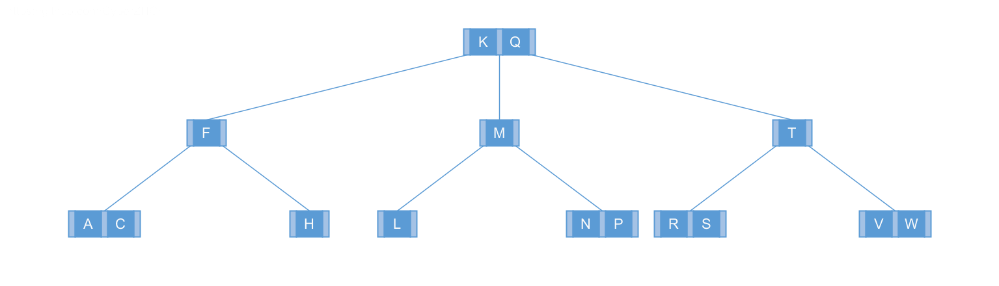

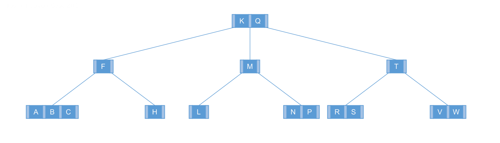

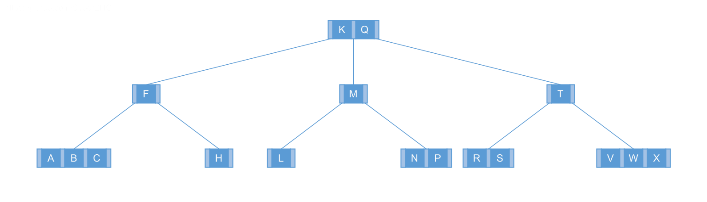

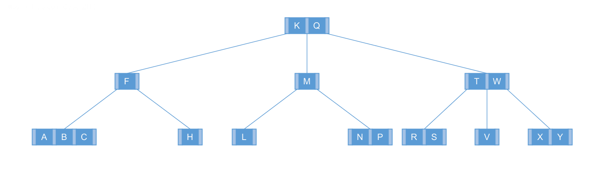

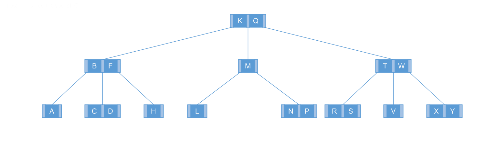

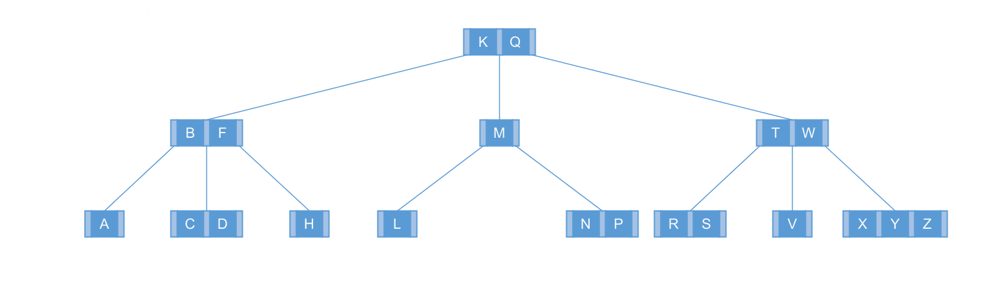

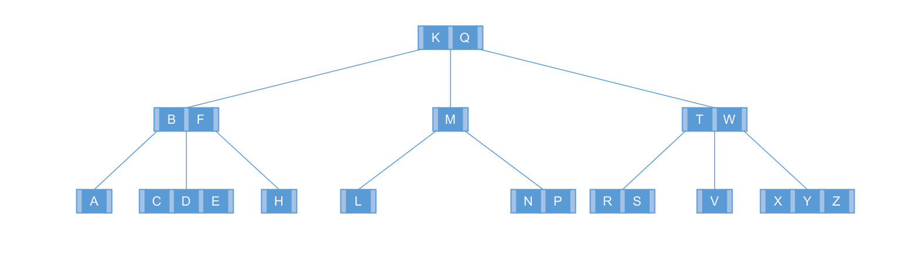

### 18.2-2

> Explain under what circumstances, if any, redundant DISK-READ or DISK-WRITE operations occur during the course of executing a call to B-TREE-INSERT. (A redundant DISK-READ is a DISK-READ for a page that is already in memory. A redundant DISK-WRITE writes to disk a page of information that is identical to what is already stored there.)

No redundant.

### 18.2-3

> Explain how to find the minimum key stored in a B-tree and how to find the predecessor of a given key stored in a B-tree.

```python
class BTreeNode:
    def __init__(self, t):
        self.n = 0
        self.key = [None] * (2 * t - 1)
        self.c = [None] * (2 * t)
        self.leaf = True


class BTree:
    def __init__(self, degree):
        self.t = degree
        self.root = BTreeNode(degree)

    def disk_read(self, x):
        pass

    def disk_write(self, x):
        pass

    def split_child(self, x, i):
        t = self.t
        z = BTreeNode(t)
        y = x.c[i]
        z.leaf = y.leaf
        z.n = t - 1
        for j in range(t - 1):
            z.key[j] = y.key[j + t]
        if not y.leaf:
            for j in range(t):
                z.c[j] = y.c[j + t]
        y.n = t - 1
        for j in range(x.n, i - 1, -1):
            x.c[j + 1] = x.c[j]
        x.c[i + 1] = z
        for j in range(x.n - 1, i - 2, -1):
            x.key[j + 1] = x.key[j]
        x.key[i] = y.key[t - 1]
        x.n += 1
        self.disk_write(y)
        self.disk_write(z)
        self.disk_write(x)

    def insert(self, k):
        t = self.t
        r = self.root
        if r.n == 2 * t - 1:
            s = BTreeNode(t)
            self.root = s
            s.leaf = False
            s.n = 0
            s.c[0] = r
            self.split_child(s, 0)
            self.insert_nonfull(s, k)
        else:
            self.insert_nonfull(r, k)

    def insert_nonfull(self, x, k):
        t = self.t
        i = x.n - 1
        if x.leaf:
            while i >= 0 and k < x.key[i]:
                x.key[i + 1] = x.key[i]
                i -= 1
            x.key[i + 1] = k
            x.n += 1
            self.disk_write(x)
        else:
            while i >= 0 and k < x.key[i]:
                i -= 1
            i += 1
            self.disk_read(x.c[i])
            if x.c[i].n == 2 * t - 1:
                self.split_child(x, i)
                if k > x.key[i]:
                    i += 1
            self.insert_nonfull(x.c[i], k)

    def minimum(self):
        def minimum_sub(x):
            if x is None:
                return None
            if x.n > 0 and x.c[0] is not None:
                return minimum_sub(x.c[0])
            return x.key[0]
        if self.root.n == 0:
            return None
        return minimum_sub(self.root)

    def predecessor(self, k):
        def predecessor_sub(x):
            if x is None:
                return None
            for i in xrange(x.n - 1, -1, -1):
                if k > x.key[i]:
                    c = predecessor_sub(x.c[i + 1])
                    if c is None:
                        return x.key[i]
                    return max(c, x.key[i])
            return predecessor_sub(x.c[0])
        if self.root.n == 0:
            return None
        return predecessor_sub(self.root)

    def successor(self, k):
        def successor_sub(x):
            if x is None:
                return None
            for i in xrange(x.n):
                if k < x.key[i]:
                    c = successor_sub(x.c[i])
                    if c is None:
                        return x.key[i]
                    return min(c, x.key[i])
            return successor_sub(x.c[x.n])
        if self.root.n == 0:
            return None
        return successor_sub(self.root)
```

### 18.2-4 $\star$

> Suppose that we insert the keys $\{1, 2, \dots, n\}$ into an empty B-tree with minimum degree 2. How many nodes does the final B-tree have?

At least $n - 2\lg(n+1)$.

### 18.2-5

> Since leaf nodes require no pointers to children, they could conceivably use a different (larger) $t$ value than internal nodes for the same disk page size. Show how to modify the procedures for creating and inserting into a B-tree to handle this variation.

.

### 18.2-6

> Suppose that we were to implement B-TREE-SEARCH to use binary search rather than linear search within each node. Show that this change makes the CPU time required $O(\lg n)$, independently of how $t$ might be chosen as a function of $n$.

$\log_{t} n \cdot \lg t = \lg n$

### 18.2-7

> Suppose that disk hardware allows us to choose the size of a disk page arbitrarily, but that the time it takes to read the disk page is $a + bt$, where $a$ and $b$ are specified constants and $t$ is the minimum degree for a B-tree using pages of the selected size. Describe how to choose $t$ so as to minimize (approximately) the B-tree search time. Suggest an optimal value of $t$ for the case in which $a = 5$ milliseconds and $b = 10$ microseconds.

$$
\min \log_t n \cdot (a + bt) = \min \frac{a + bt}{\ln t}
$$

$$
\frac{\partial}{\partial t} \left ( \frac{a + bt}{\ln t} \right ) = - \frac{a + bt - bt \ln t}{t \ln^2 t}
$$
$$
\begin{array}{rll}
a + bt &=& bt \ln t \\
5 + 10t &=& 10t \ln t \\
t &=& \displaystyle e^{W \left ( \frac{1}{2e} \right ) + 1} \\
\end{array}
$$

where $W$ is the LambertW function, and we should choose $t=3$.
