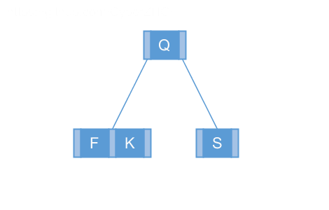

## 18.2 Basic operations on B-trees

### 18.2-1

> Show the results of inserting the keys 

> $$F, S, Q, K, C, L, H, T, V, W, M, R, N, P, A, B, X, Y, D, Z, E$$

> in order into an empty B-tree with minimum degree 2. Draw only the configurations of the tree just before some node must split, and also draw the final configuration.

