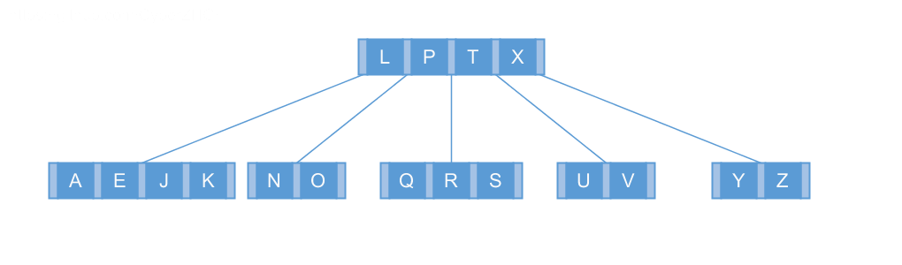
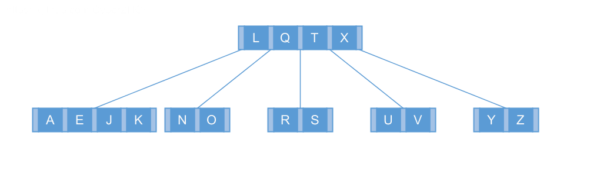
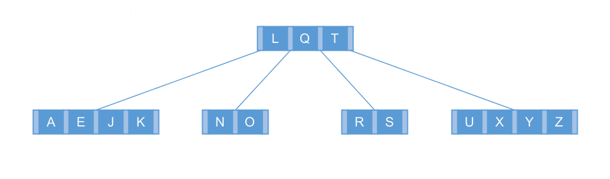

## 18.3 Deleting a key from a B-tree

### 18.3-1

> Show the results of deleting $$C$$, $$P$$, and $$V$$, in order, from the tree of Figure 18.8(f).

### 18.3-2

> Write pseudocode for B-TREE-DELETE.

