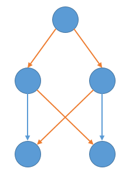

## 22.2 Breadth-first search

### 22.2-1

> Show the $d$ and $\pi$ values that result from running breadth-first search on the directed graph of Figure 22.2(a), using vertex 3 as the source.

| \ | 1 | 2 | 3 | 4 | 5 | 6 |
|:-:|:-:|:-:|:-:|:-:|:-:|:-:|
| $d$ | $\infty$ | 3 | 0 | 2 | 1 | 1 |
| $\pi$ | NIL | 4 | NIL | 5 | 3 | 3 |

### 22.2-2

> Show the $d$ and $\pi$ values that result from running breadth-first search on the undirected graph of Figure 22.3, using vertex $u$ as the source.

| \ | $r$ | $s$ | $t$ | $u$ | $v$ | $w$ | $x$ | $y$ |
|:-:|:-:|:-:|:-:|:-:|:-:|:-:|:-:|:-:|
| $d$ | 4 | 3 | 1 | 0 | 5 | 2 | 1 | 1 |
| $\pi$ | $s$ | $w$ | $u$ | NIL | $r$ | $x$ | $u$ | $u$ |

### 22.2-3

> Show that using a single bit to store each vertex color suffices by arguing that the BFS procedure would produce the same result if lines 5 and 14 were removed.

Duplicate.

### 22.2-4

> What is the running time of BFS if we represent its input graph by an adjacency matrix and modify the algorithm to handle this form of input?

$\Theta(V^2)$.

### 22.2-5

> Argue that in a breadth-first search, the value $u.d$ assigned to a vertex $u$ is independent of the order in which the vertices appear in each adjacency list. Using Figure 22.3 as an example, show that the breadth-first tree computed by BFS can depend on the ordering within adjacency lists.

$\delta$

### 22.2-6

> Give an example of a directed graph $G = (V, E)$, a source vertex $s \in V$, and a set of tree edges $E\_\pi \subseteq E$ such that for each vertex $v \in V$, the unique simple path in the graph $(V, E\_\pi)$ from $s$ to $v$ is a shortest path in $G$, yet the set of edges $E\_\pi$ cannot be produced by running BFS on $G$, no matter how the vertices are ordered in each adjacency list.

### 22.2-7

> There are two types of professional wrestlers: "babyfaces" ("good guys") and "heels" ("bad guys"). Between any pair of professional wrestlers, there may or may not be a rivalry. Suppose we have $n$ professional wrestlers and we have a list of $r$ pairs of wrestlers for which there are rivalries. Give an $O(n+r)$-time algorithm that determines whether it is possible to designate some of the wrestlers as babyfaces and the remainder as heels such that each rivalry is between a babyface and a heel. If it is possible to perform such a designation, your algorithm should produce it.

BFS, the new reachable node should have a different type. If the new node already have the same type with the current node, then it is impossible to perform such a designation.

### 22.2-8 $\star$

> The __*diameter*__ of a tree $T = (V, E)$ is defined as $\max\_{u,v \in V}\delta(u,v)$, that is, the largest of all shortest-path distances in the tree. Give an efficient algorithm to compute the diameter of a tree, and analyze the running time of your algorithm.

BFS with a random node as the source, then BFS from the node with the largest $\delta$, the largest $\delta$ in the second BFS is the diameter of the tree, $O(V + E)$.

### 22.2-9

> Let $G = (V, E)$ be a connected, undirected graph. Give an $O(V + E)$-time algorithm to compute a path in $G$ that traverses each edge in $E$ exactly once in each direction. Describe how you can find your way out of a maze if you are given a large supply of pennies.

Eulerian path.
