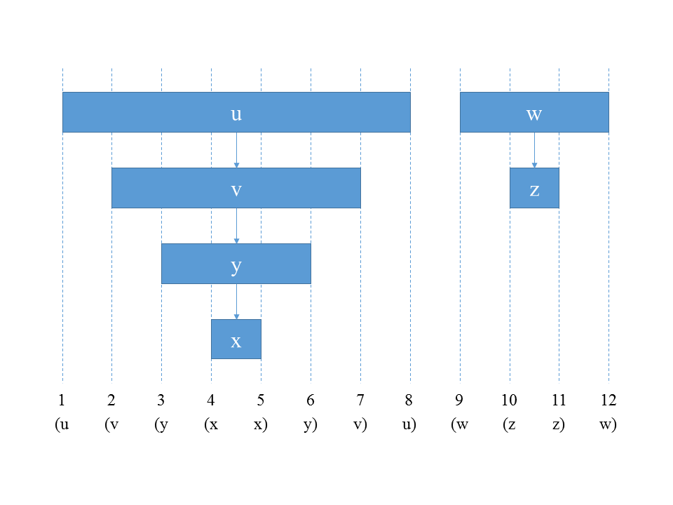

## 22.3 Depth-first search

### 22.3-1

> Make a 3-by-3 chart with row and column labels WHITE, GRAY, and BLACK. In each cell $$(i, j)$$, indicate whether, at any point during a depth-first search of a directed graph, there can be an edge from a vertex of color $$i$$ to a vertex of color $$j$$. For each possible edge, indicate what edge types it can be. Make a second such chart for depth-first search of an undirected graph.

Directed:

| $$i$$ \ $$j$$ | WHITE | GRAY | BLACK |
|:-:|:-:|:-:|:-:|
|WHITE|$$\checkmark$$|$$\checkmark$$|$$\checkmark$$|
|GRAY|$$\checkmark$$|$$\checkmark$$|$$\checkmark$$|
|BLACK||$$\checkmark$$|$$\checkmark$$|

Undirected:

| $$i$$ \ $$j$$ | WHITE | GRAY | BLACK |
|:-:|:-:|:-:|:-:|
|WHITE|$$\checkmark$$|$$\checkmark$$||
|GRAY|$$\checkmark$$|$$\checkmark$$|$$\checkmark$$|
|BLACK||$$\checkmark$$|$$\checkmark$$|

### 22.3-2

> Show how depth-first search works on the graph of Figure 22.6. Assume that the __*for*__ loop of lines 5–7 of the DFS procedure considers the vertices in alphabetical order, and assume that each adjacency list is ordered alphabetically. Show the discovery and finishing times for each vertex, and show the classification of each edge.

* q: 1, 16
* r: 17, 20
* s: 2, 7
* t: 8, 15
* u: 18, 19
* v: 3, 6
* w: 4, 5
* x: 9, 12
* y: 13, 14
* z: 10, 11

* Tree edges: (q, s) (s, v) (v, w) (q, t) (t, x) (x, z) (t, y) (r, u)
* Back edges: (w, s) (z, x), (y, q)
* Forward edges: (q, w)
* Cross edges: (r, y) (u, y)

### 22.3-3

> Show the parenthesis structure of the depth-first search of Figure 22.4.

