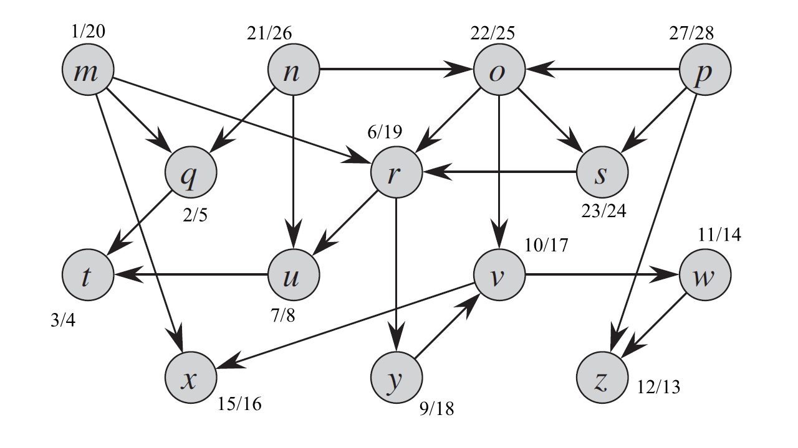

## 22.4 Topological sort

### 22.4-1

> Show the ordering of vertices produced by TOPOLOGICAL-SORT when it is run on the dag of Figure 22.8, under the assumption of Exercise 22.3-2.

p, n, o, s, m, r, y, v, x, w, z, u, q, t.

### 22.4-2

> Give a linear-time algorithm that takes as input a directed acyclic graph $G = (V, E)$ and two vertices $s$ and $t$, and returns the number of simple paths from $s$ to $t$ in $G$. For example, the directed acyclic graph of Figure 22.8 contains exactly four simple paths from vertex $p$ to vertex $v$: $pov$, $poryv$, $posryv$, and $psryv$. (Your algorithm needs only to count the simple paths, not list them.)

Topological sort + dynamic programming.

### 22.4-3

> Give an algorithm that determines whether or not a given undirected graph $G = (V, E)$ contains a cycle. Your algorithm should run in $O(V)$ time, independent of $|E|$.

Undirected + acyclic -> forest.

DFS, if there is a back edge, then it contains cycle. At most $|V| - 1$ edges are needed to examine since there are at most $|V| - 1$ edges in the forest.

### 22.4-4
 
> Prove or disprove: If a directed graph $G$ contains cycles, then TOPOLOGICAL-SORT$(G)$ produces a vertex ordering that minimizes the number of "bad" edges that are inconsistent with the ordering produced.

$E = \\{ (a, b), (b, c), (c, b), (c, a) \\}$

Bad edges if begins from $b$: $(c, b), (a, b)$.
Bad edge if begins from $c$: $(b, c)$.

The number of bad edges depends on the ordering of DFS.

### 22.4-5

> Another way to perform topological sorting on a directed acyclic graph $G = (V, E)$ is to repeatedly find a vertex of in-degree $0$, output it, and remove it and all of its outgoing edges from the graph. Explain how to implement this idea so that it runs in time $O(V + E)$. What happens to this algorithm if $G$ has cycles?

Maintain the in-degrees of the nodes. If the in-degree is 0, then add the node to a queue. When removing a node, all the nodes it connects to should subtract their in-degrees by 1.
