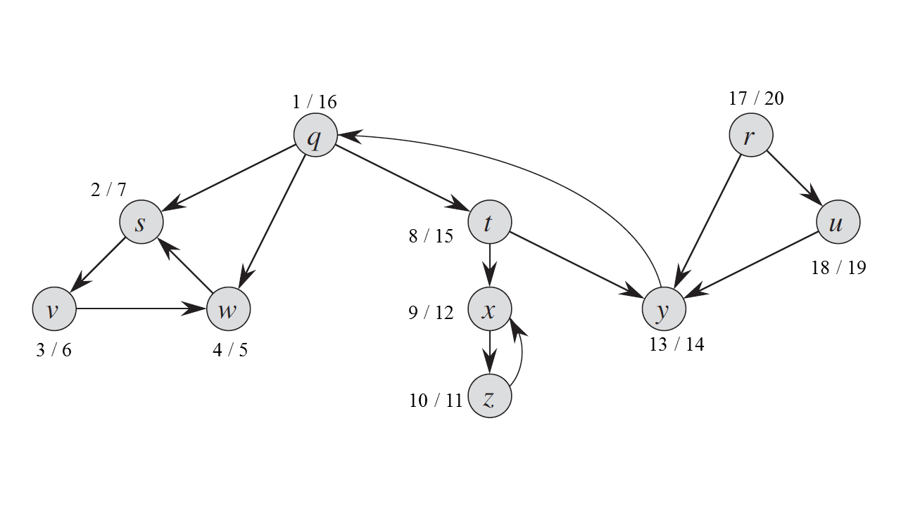

## 22.5 Strongly connected components

### 22.5-1

> How can the number of strongly connected components of a graph change if a new edge is added?

$-(K - 1) \sim +1$.

### 22.5-2

> Show how the procedure STRONGLY-CONNECTED-COMPONENTS works on the graph of Figure 22.6. Specifically, show the finishing times computed in line 1 and the forest produced in line 3. Assume that the loop of lines 5–7 of DFS considers vertices in alphabetical order and that the adjacency lists are in alphabetical order.

{r}, {u}, {q, y, t}, {x, z}, {s, w, v}

### 22.5-3

> Professor Bacon claims that the algorithm for strongly connected components would be simpler if it used the original (instead of the transpose) graph in the second depth-first search and scanned the vertices in order of _increasing_ finishing times. Does this simpler algorithm always produce correct results?

No.

### 22.5-4

> Prove that for any directed graph $G$, we have $((G^T)^{SCC})^T = G^{SCC}$. That is, the transpose of the component graph of $G^T$ is the same as the component graph of $G$.

$u \leadsto v \overset{T}{\rightarrow} v \leadsto u$.

### 22.5-5

> Give an $O(V + E)$-time algorithm to compute the component graph of a directed graph $G = (V, E)$. Make sure that there is at most one edge between two vertices in the component graph your algorithm produces.

Add edge $(u', v')$ if $u \in C\_{u'}$, $v \in C\_{v'}$ and there is an edge $(u, v) \in E$.

### 22.5-6

> Given a directed graph $G = (V, E)$, explain how to create another graph $G' = (V, E')$ such that (a) $G'$ has the same strongly connected components as $G$, (b) $G'$ has the same component graph as $G$, and (c) $E'$ is as small as possible. Describe a fast algorithm to compute $G'$.

Calculate SCCs, create a loop in each SCC, connect SCCs with one edge.

### 22.5-7 

> A directed graph $G = (V, E)$ is __*semiconnected*__ if, for all pairs of vertices $u, v \in V$, we have $u \leadsto v$ or $v \leadsto u$. Give an efficient algorithm to determine whether or not $G$ is semiconnected. Prove that your algorithm is correct, and analyze its running time.

If $\forall i \in [1, K)$, there is an edge $(u,v) \in E$, $u \in C\_i$, $v \in C\_{i+1}$, then the graph is semiconnected, $O(V + E)$.
