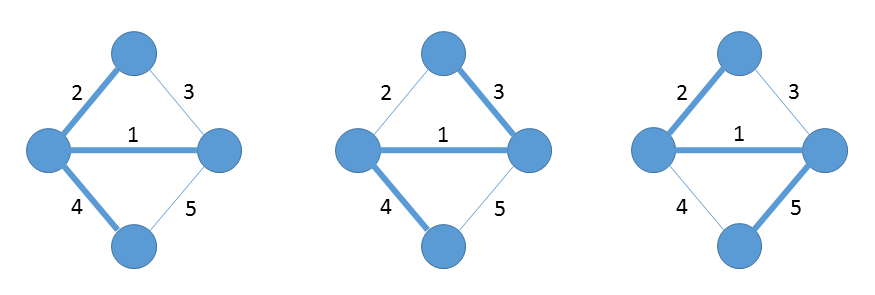

## Problems

### 23-1 Second-best minimum spanning tree

> Let $$G = (V, E)$$ be an undirected, connected graph whose weight function is $$w: E \rightarrow \mathbb{R}$$, and suppose that $$|E| \ge |V|$$ and all edge weights are distinct.

> We define a second-best minimum spanning tree as follows. Let $$\mathcal{T}$$ be the set of all spanning trees of $$G$$, and let $$T'$$ be a minimum spanning tree of $$G$$. Then a __*second-best minimum spanning tree*__ is a spanning tree $$T$$ such that $$W(T) = \min_{T'' \in \mathcal{T}-\{T'\}}\{w(T'')\}$$.

> __*a*__. Show that the minimum spanning tree is unique, but that the second-best minimum spanning tree need not be unique.



> __*b*__. Let $$T$$ be the minimum spanning tree of $$G$$. Prove that $$G$$ contains edges $$(u, v) \in T$$ and $$(x, y) \notin T$$ such that $$T - \{(u, v)\} \cup \{(x, y)\}$$ is a second-best minimum spanning tree of $$G$$.

$$\dots$$

> __*c*__. Let $$T$$ be a spanning tree of $$G$$ and, for any two vertices $$u, v \in V$$, let $$max[u,v]$$ denote an edge of maximum weight on the unique simple path between $$u$$ and $$v$$ in $$T$$. Describe an $$O(V^2)$$-time algorithm that, given $$T$$, computes $$max[u, v]$$ for all $$u, v \in V$$.

Search from each vertex.

> __*d*__. Give an efficient algorithm to compute the second-best minimum spanning tree of $$G$$.

Find an edge $$(u, v) \notin T$$ with weight $$w$$ that minimizes $$w - max[u,v]$$. The time is $$O(V^2)$$.

### 23-2 Minimum spanning tree in sparse graphs

> For a very sparse connected graph $$G = (V, E)$$, we can further improve upon the $$O(E + V \lg V)$$ running time of Prim's algorithm with Fibonacci heaps by preprocessing $$G$$ to decrease the number of vertices before running Prim's algorithm. In particular, we choose, for each vertex $$u$$, the minimum-weight edge $$(u, v)$$ incident on $$u$$, and we put $$(u, v)$$ into the minimum spanning tree under construction. We then contract all chosen edges (see Section B.4). Rather than contracting these edges one at a time, we first identify sets of vertices that are united into the same new vertex. Then we create the graph that would have resulted from contracting these edges one at a time, but we do so by "renaming" edges according to the sets into which their endpoints were placed. Several edges from the original graph may be renamed the same as each other. In such a case, only one edge results, and its weight is the minimum of the weights of the corresponding original edges.

> Initially, we set the minimum spanning tree $$T$$ being constructed to be empty, and for each edge $$(u, v) \in E$$, we initialize the attributes $$(u, v).orig = (u, v)$$ and $$(u, v).c = w(u, v)$$. We use the orig attribute to reference the edge from the initial graph that is associated with an edge in the contracted graph. The $$c$$ attribute holds the weight of an edge, and as edges are contracted, we update it according to the above scheme for choosing edge weights. The procedure MST-REDUCE takes inputs $$G$$ and $$T$$, and it returns a contracted graph $$G'$$ with updated attributes $$orig'$$ and $$c'$$. The procedure also accumulates edges of $$G$$ into the minimum spanning tree $$T$$.

> ```
MST-REDUCE(G, T)
1  for each v in G.V
2       v.mark = FALSE
3       MAKE-SET(v)
4  for each u in G.V
5       if u.mark == FALSE
6            choose v in G.Adj[u] such that (u, v).c is minimized
7            UNION(u, v)
8            T = T [ f(u, v).origg
9            u.mark = v.mark = TRUE
10  G'.V = {FIND-SET(v) : v in G.V}
11  G'.E = empty
12  for each (x, y) in G.E
13       u = FIND-SET(x)
14       v = FIND-SET(y)
15       if (u, v) not in G'.E
16            G'.E = G'.E union {(u, v)}
17            (u, v).orig' = (x, y).orig
18            (u, v).c' = (x, y).c
19       else if (x, y).c < (u,v).c'
20            (u, v).orig' = (x, y).orig
21            (u, v).c' = (x, y).c
22  construct adjacency lists G'.Adj for G'
23  return G' and T
```

> __*a*__. Let $$T$$ be the set of edges returned by MST-REDUCE, and let $$A$$ be the minimum spanning tree of the graph $$G'$$ formed by the call MST-PRIM$$(G', c', r)$$, where $$c'$$ is the weight attribute on the edges of $$G'.E$$ and $$r$$ is any vertex in $$G'.V$$. Prove that $$T \cup \{(x,y).orig':(x, y) \in A \}$$ is a minimum spanning tree of $$G$$.

> __*b*__. Argue that $$|G'.V| \le |V| / 2$$.

> __*c*__. Show how to implement MST-REDUCE so that it runs in $$O(E)$$ time. (Hint: Use simple data structures.)

> __*d*__. Suppose that we run $$k$$ phases of MST-REDUCE, using the output $$G'$$ produced by one phase as the input $$G$$ to the next phase and accumulating edges in $$T$$. Argue that the overall running time of the $$k$$ phases is $$O(kE)$$.

> __*e*__. Suppose that after running $$k$$ phases of MST-REDUCE, as in part (d), we run Prim's algorithm by calling MST-PRIM$$(G', c', r)$$, where $$G'$$, with weight attribute $$c'$$, is returned by the last phase and $$r$$ is any vertex in $$G'.V$$. Show how to pick $$k$$ so that the overall running time is $$O(E\lg \lg V)$$. Argue that your choice of $$k$$ minimizes the overall asymptotic running time.

> __*f*__. For what values of $$|E|$$ (in terms of $$|V|$$) does Prim's algorithm with preprocessing asymptotically beat Prim's algorithm without preprocessing?

### 23-3 Bottleneck spanning tree

> A bottleneck spanning tree $$T$$ of an undirected graph $$G$$ is a spanning tree of $$G$$ whose largest edge weight is minimum over all spanning trees of $$G$$. We say that the value of the bottleneck spanning tree is the weight of the maximum-weight edge in $$T$$.

> __*a*__. Argue that a minimum spanning tree is a bottleneck spanning tree. 

Based on exercise 23.1-8, all MSTs have the same sorted weight list, thus they have the same bottleneck.

> Part (a) shows that finding a bottleneck spanning tree is no harder than finding a minimum spanning tree. In the remaining parts, we will show how to find a bottleneck spanning tree in linear time.

> __*b*__. Give a linear-time algorithm that given a graph $$G$$ and an integer $$b$$, determines whether the value of the bottleneck spanning tree is at most $$b$$.

DFS on the graph with the edges that their weights are less or equal to $$b$$.

> __*c*__. Use your algorithm for part (b) as a subroutine in a linear-time algorithm for the bottleneck-spanning-tree problem. (Hint: You may want to use a subroutine that contracts sets of edges, as in the MST-REDUCE procedure described in Problem 23-2.)

Binary search for $$b$$.

### 23-4 Alternative minimum-spanning-tree algorithms

> In this problem, we give pseudocode for three different algorithms. Each one takes a connected graph and a weight function as input and returns a set of edges $$T$$. For each algorithm, either prove that $$T$$ is a minimum spanning tree or prove that $$T$$ is not a minimum spanning tree. Also describe the most efficient implementation of each algorithm, whether or not it computes a minimum spanning tree.

> __*a*__. 
> ```
MAYBE-MST-A(G, w)
1  sort the edges into nonincreasing order of edge weights w
2  T = E
3  for each edge e, taken in nonincreasing order by weight
4       if T - {e} is a connected graph
5            T = T - {e}
6  return T
```

> __*b*__. 
> ```
MAYBE-MST-B(G, w)
1  T = {}
2  for each edge e, taken in arbitrary order
3       if T U {e} has no cycles
4            T = T U {e}
5  return T
```

> __*c*__. 
> ```
MAYBE-MST-C(G, w)
1  T = {}
2  for each edge e, taken in arbitrary order
3       T = T U {e}
4       if T has a cycle c
5            let e’ be a maximum-weight edge on c
6            T = T - {e}
7  return T
```
