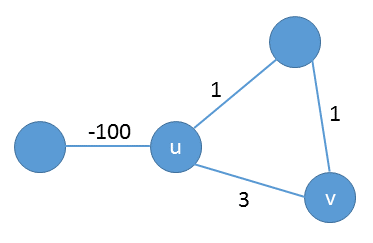

## 25.3 Johnson's algorithm for sparse graphs

### 25.3-1

> Use Johnson's algorithm to find the shortest paths between all pairs of vertices in the graph of Figure 25.2. Show the values of $$h$$ and $$\hat{w}$$ computed by the algorithm.

### 25.3-2

> What is the purpose of adding the new vertex $$s$$ to $$V'$$, yielding $$V'$$?

To reach all the vertices.

### 25.3-3

> Suppose that $$w(u, v) \ge 0$$ for all edges $$(u, v) \in E$$. What is the relationship between the weight functions $$w$$ and $$\hat{w}$$?

$$h(u) = h(v) = 0$$, $$w = \hat{w}$$.

## 25.3-4

> Professor Greenstreet claims that there is a simpler way to reweight edges than the method used in Johnson's algorithm. Letting $$w^* = \min_{(u, v) \in E} \{ w(u, v) \}$$, just define $$\hat{w}(u, v) = w(u, v) - w^*$$ for all edges $$(u, v) \in E$$. What is wrong with the professor's method of reweighting?

$$\hat{w}(p) = w(p) - (k-1)w^*$$.

### 25.3-5

> Suppose that we run Johnson's algorithm on a directed graph $$G$$ with weight function $$w$$. Show that if $$G$$ contains a 0-weight cycle $$c$$, then $$\hat{w}(u, v) = 0$$ for every edge $$(u, v)$$ in $$c$$.

$$\delta(s, v) - \delta(s, u) \le w(u, v)$$, if $$\delta(s, v) - \delta(s, u) < w(u, v)$$, then we have $$\delta(s, u) \le \delta(s, v) + (0 - w(u, v)) < \delta(s, u) + w(u, v) - w(u, v) = \delta(s, u)$$, which is impossible, thus $$\delta(s, v) - \delta(s, u) = w(u, v)$$, $$\hat{w}(u, v) = w(u, v) + \delta(s, u) - \delta(s, v) = 0$$.

### 25.3-6

> Professor Michener claims that there is no need to create a new source vertex in line 1 of JOHNSON. He claims that instead we can just use $$G' = G$$ and let $$s$$ be any vertex. Give an example of a weighted, directed graph $$G$$ for which incorporating the professor's idea into JOHNSON causes incorrect answers. Then show that if $$G$$ is strongly connected (every vertex is reachable from every other vertex), the results returned by JOHNSON with the professor's modification are correct.

$$E = \{ (u, s) \}$$.

