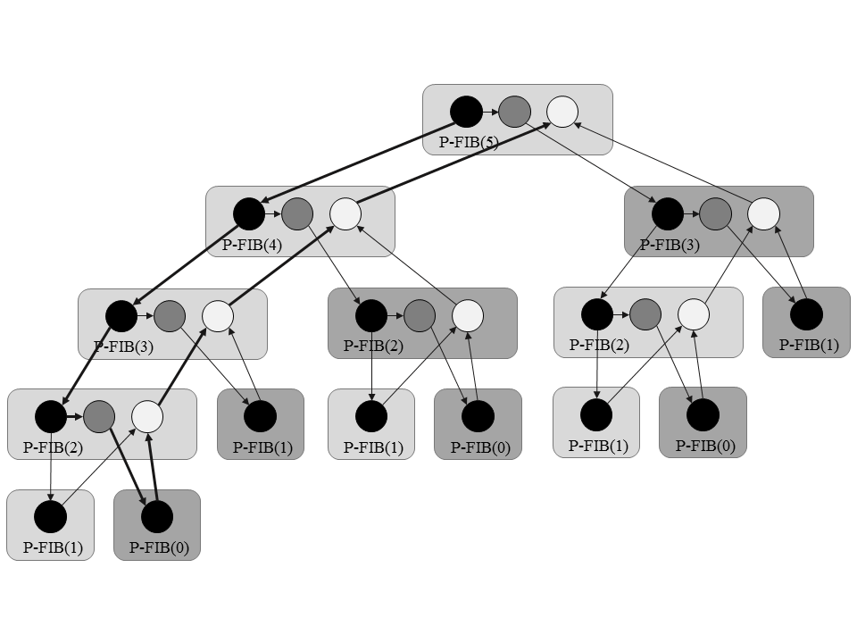

## 27.1 The basics of dynamic multithreading

### 27.1-1

> Suppose that we spawn P-FIB$$(n - 2)$$ in line 4 of P-FIB, rather than calling it as is done in the code. What is the impact on the asymptotic work, span, and parallelism?

No change.

### 27.1-2

> Draw the computation dag that results from executing P-FIB(5). Assuming that each strand in the computation takes unit time, what are the work, span, and parallelism of the computation? Show how to schedule the dag on 3 processors using greedy scheduling by labeling each strand with the time step in which it is executed.



* Work: $$T_1 = 29$$.
* Span: $$T_\infty = 9$$.
* Parallelism: $$T_1 / T_\infty \approx 3.2$$.

### 27.1-3

> Prove that a greedy scheduler achieves the following time bound, which is slightly stronger than the bound proven in Theorem 27.1:

> $$\displaystyle T_P \le \frac{T_1 - T_\infty}{P} + T_\infty$$.

$$T_1 - T_\infty$$ is the number of  strands that are not belong to the longest path.

### 27.1-4

> Construct a computation dag for which one execution of a greedy scheduler can take nearly twice the time of another execution of a greedy scheduler on the same number of processors. Describe how the two executions would proceed.

The critical path is twice the length of the other path.

### 27.1-5

> Professor Karan measures her deterministic multithreaded algorithm on $$4$$, $$10$$, and $$64$$ processors of an ideal parallel computer using a greedy scheduler. She claims that the three runs yielded $$T_4 = 80$$ seconds, $$T_{10} = 42$$ seconds, and $$T_{64} = 10$$ seconds. Argue that the professor is either lying or incompetent. (Hint: Use the work law (27.2), the span law (27.3), and inequality (27.5) from Exercise 27.1-3.)

Based on span law:

$$T_\infty \le T_P = \min\{ 80, 42, 10 \} = 10$$

Based on inequality (27.5):

$$\left \{ 
\begin{array}{rll}
T_1 + 3T_\infty &\ge& 320 \\
T_1 + 9T_\infty &\ge& 420
\end{array}
\right .$$

$$6 T_\infty \ge 100$$, $$T_\infty \ge 16$$, which contradicts the span law.

### 27.1-6

> Give a multithreaded algorithm to multiply an $$n \times n$$ matrix by an $$n$$-vector that achieves $$\Theta(n^2 / \lg n)$$ parallelism while maintaining $$\Theta(n^2)$$ work.

```
VEC-TIMES-VEC(a, b, l, r)
1  if l == r
2      return a[l] * b[r]
2  m = floor((l + r) / 2)
3  spawn sum_l = VEC-TIMES-VEC(a, b, l, m)
4  spawn sum_r = VEC-TIMES-VEC(a, b, m + 1, r)
5  sync
6  return sum_l + sum_r
```

The multiply of two vectors is thus $$\Theta(\lg n)$$, there are $$n$$ vectors to multiply simultaneously, and the outer parallel for is optimized to $$\Theta(\lg n)$$, therefore $$T_\infty = \Theta(\lg n)$$, since $$T_1 = \Theta(n^2)$$, then the parallelism $$T_1 / T_\infty = \Theta(n^2 / \lg n)$$.

### 27.1-7

> Consider the following multithreaded pseudocode for transposing an $$n \times n$$ matrix $$A$$ in place:
> 
> ```
P-TRANSPOSE(A)
1  n = A.rows
2  parallel for j = 2 to n
3      parallel for i = 1 to j - 1
4          exchange a_ij with a_ji
```
>
> Analyze the work, span, and parallelism of this algorithm.

* Work: $$T_1 = \Theta(n^2)$$.
* Span: $$T_\infty = \Theta(\lg n)$$.
* Parallelism: $$T_1 / T_\infty = \Theta(n^2 / \lg n)$$.

### 27.1-8

> Suppose that we replace the__*parallel for*__ loop in line 3 of P-TRANSPOSE (see Exercise 27.1-7) with an ordinary __*for*__ loop. Analyze the work, span, and parallelism of the resulting algorithm.

* Work: $$T_1 = \Theta(n^2)$$.
* Span: $$T_\infty = \Theta(n)$$.
* Parallelism: $$T_1 / T_\infty = \Theta(n)$$.

### 27.1-9

> For how many processors do the two versions of the chess programs run equally fast, assuming that $$T_P = T_1 / P + T_\infty$$?

$$
\begin{array}{rll}
T_1 / P + T_\infty &=& T_1' / P + T_\infty' \\
2048 + P &=& 1024 + 8P \\
P &=& 1024 / 7 \\
&\approx & 146
\end{array}
$$
