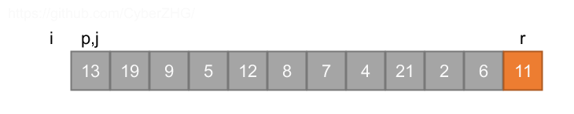
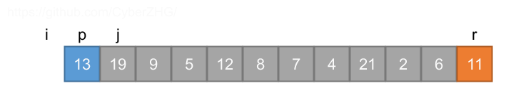
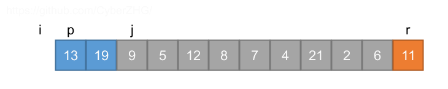
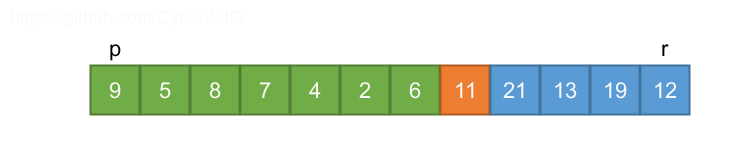

## 7.1 Description of quicksort

### 7.1-1

> Using Figure 7.1 as a model, illustrate the operation of PARTITION on the array $$A = \left \langle 13, 19, 9, 5, 12, 8, 7, 4, 21, 2, 6, 11 \right \rangle$$.










### 7.1-2

> What value of $$q$$ does PARTITION return when all elements in the array $$A[p \dots r]$$ have the same value? Modify PARTITION so that $$q = \left \lfloor(p + r)/2 \right \rfloor$$ when all elements in the array $$A[p \dots r]$$ have the same value.

PARTITION returns $$r$$.

```python
def partition(a, p, r):
    if p == r:
        return p
    x = a[r - 1]
    i = p - 1
    cnt = 0
    for j in range(p, r - 1):
        if a[j] <= x:
            if a[j] == x:
                cnt += 1
            i += 1
            a[i], a[j] = a[j], a[i]
    i += 1
    a[i], a[r - 1] = a[r - 1], a[i]
    return i - cnt // 2
```

### 7.1-3

> Give a brief argument that the running time of PARTITION on a subarray of size $$n$$ is $$\Theta(n)$$.

Only one loop.

### 7.1-4

> How would you modify QUICKSORT to sort into nonincreasing order?

```python
def partition(a, p, r):
    x = a[r - 1]
    i = p - 1
    for j in range(p, r - 1):
        if a[j] >= x:
            i += 1
            a[i], a[j] = a[j], a[i]
    i += 1
    a[i], a[r - 1] = a[r - 1], a[i]
    return i


def quicksort(a, p, r):
    if p < r - 1:
        q = partition(a, p, r)
        quicksort(a, p, q)
        quicksort(a, q + 1, r)
```
